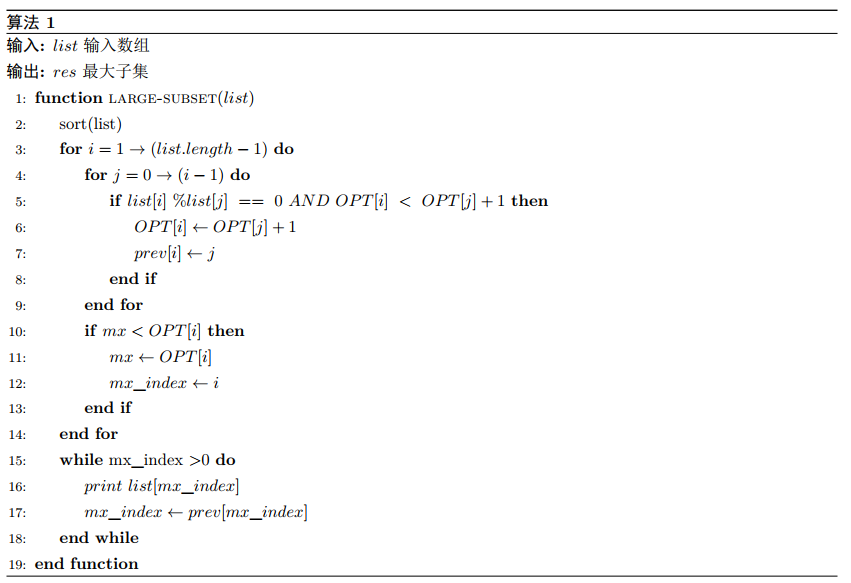
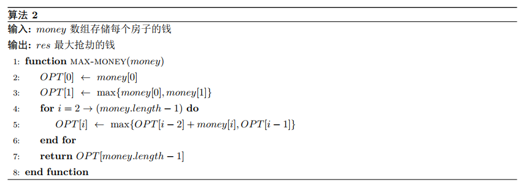
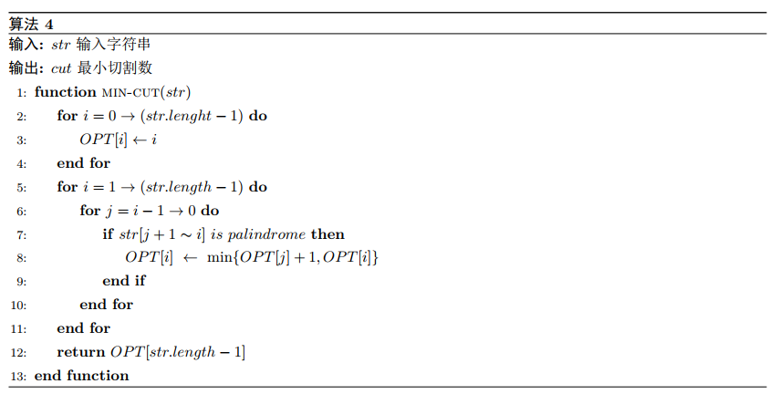
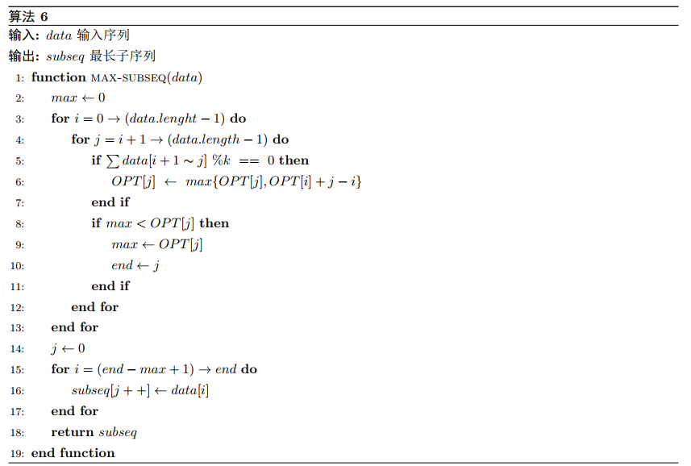

### 1 Largest Divisible Subset 

OPT[i]表示第i元素前的最大子集。为方便每步决策时判断对于OPT[i]下的每个元素是否整除，这里先将元素从小到大排序，有i从$1 \thicksim length-1$，j从$0 \thicksim i-1$进行遍历，对于list[i]和list[j]，若$list[i]\ \%list[j]\ ==\ 0$，则list[i]必定可以整除OPT[j]下最大子集中的所有元素，因此得到动态规划递推式$OPT[i]\ =\ \max \{OPT[i], OPT[j]+1\}$。最后通过prev数组把整个subset回溯。

我们得到动态规划递推公式$OPT[i]\ =\ \max \{OPT[i], OPT[j]+1\}$，第i个问题可以通过比其小的子问题求解得出，因此，通过动态规划可以得到最优解。

对list排序所用时间为$O(\log n)$，求最大子集所用时间为$O(n^2)$，最后回溯用了$O(n)$，因此，总时间复杂度为$O(n^2)$。

### 2 Money robbing 

1，在第i步决策时，对第i个房子有两种选择。选 $OPT[i]=OPT[i-2]+money[i]$；不选-则得到动态规划递推式$OPT[i]=max\{OPT[i-2]+money[i],OPT[i-1]\}$。
2，当屋子排列成环时，在第一种情况的基础上，判断当抢第一个房子并且不抢最后一个房子，以及不抢第一个房子并且抢最后一个房子的最大值。也即分别$0\thicksim length-2$和$1\thicksim length-1$情况下的最大值。

此问题有最优子结构，递推式为$OPT[i]=max\{OPT[i-2]+money[i],OPT[i-1]\}$，第i个问题可由第i-2或者i-1子问题得出，因此通过动态规划可以得出最优解。

本问题要对money数组进行遍历，时间复杂度为$O(n)$

### 3 Partition 

对于str，初始化OPT[i]=i，表示第i元素前的最小分割数。有两个指针i，j，i从$1\thicksim length-1$，j从$i-1\thicksim 0$进行遍历，若$str[j+1\thicksim i]$是回文数，则有两种决策，从j处割或者不割，割的话最优解OPT[i]是OPT[j]+1，不割是OPT[i]，因此，可得到动态规划最优子问题递推式$OPT[i] = min\{OPT[j]+1,OPT[i]\}$。

此问题有最优子结构，递推式为$OPT[i] = min\{OPT[j]+1,OPT[i]\}​$，第i个问题可由比其小的子问题得出，因此通过动态规划可以得出最优解。

本问题要由i，j对str数组进行遍历，用时$\frac{n\times(n-1)}{2}，$时间复杂度为$O(n^2)$

### 4 Decoding 

$s[i-1]=0\qquad ->\qquad dp[i]=dp[i-2]$

$s[i-2]=0||s[i-2\sim i-1]>26\qquad->\qquad dp[i]=dp[i-1]$

$其他\qquad ->\qquad dp[i]=dp[i-2]+dp[i-1]$

### 5 Longest Consecutive Subsequence 

若OPT[i]是以第i元素结尾的连续子序列长度。j从i+1到length-1进行遍历，若$\sum\{data[i+1\thicksim j]\}$是k的整倍数，则$OPT[j]=max\{OPT[j],OPT[i]+j-i\}$，并更新最长子序列的结束位置是i或者j，然后对最长子序列进行回溯。

此问题有最优子结构$OPT[j]=max\{OPT[j],OPT[i]+j-i\}$，第j个问题可由比其小的子问题得出，因此通过动态规划可以得出最优解。

本问题要由i，j对data数组进行遍历，用时$\frac{n\times(n-1)}{2}，$时间复杂度为$O(n^2)$

