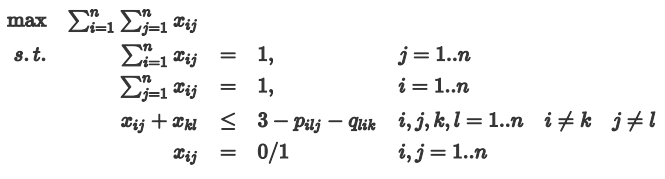
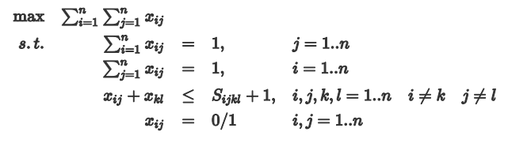
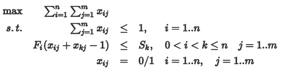
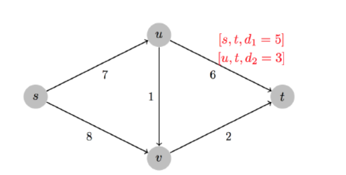
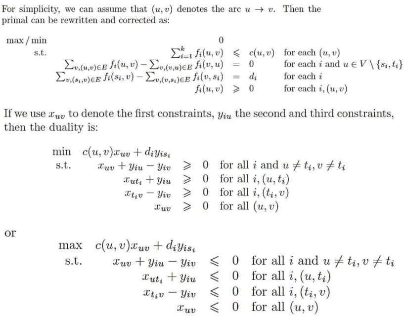

### 1 Linear-inequality feasibility

当有LP的算法，我们让m个线性不等式作为LP的约束，设置常数为目标函数，使用解LP的算法进行求解，如果有可行解，则其为线性不等式可行域的一个解，若LP无可行解，则原线性不等式无解。

### 2 Airplane Landing Problem 

$$
\begin{align*}
max\qquad &d\\
s.t.\qquad &s_i<x_i<t_i\qquad &where\ i=1,2,3\dots ,n\\
&s_1<t_1<s_2<t_2<\dots <s_n<t_n\qquad &\\
&x_j-x_{j-1}\geq d &where\ j=2,3\dots ,n
\end{align*}
$$

参数说明：
优化目标d是相邻着陆飞机最短时间差
$x_i$是第i架飞机实际着陆时间
$s_i和t_i$分别是第i架飞机着陆窗口的起始点和结束点

### 3 Interval Scheduling Problem 

将课程按Fi 进行排序 , xij 为1就是课程i 安排在教室j，则有: 

对于第一个约束，保证了一门课只安排在一间教室
第二个约束为：若两门课安排在同一个教室，则它们时间不能冲突。当 $x_{ij} = x_{kj} = 1$时，说明课程i和课程j 被安排在同一间教室，它们课程不能冲突，说明$F_i <= S_k$ 。 若两者不全为1时（全为0或一个为1）,显然满足条件。 

### 4 Gas Station Placement 

$$
\begin{align*}
min\qquad &max\_dis\\
s.t.\qquad &-r<d_i-g_i<r\qquad &where\ i=1,2,3\dots ,n\\
&g_{i+1}-g_i\leq max\_dis &where\ i=1,3\dots ,n\\
&d_1<d_2<\dots <d_n\\
&d_i,max\_dis,r>0
\end{align*}
$$

参数说明：
优化目标$max\_dis$是相邻加油站最大间隔
$d_i$是第i个town的坐标
$g_i$是第i个加油站的坐标
$r$是加油站离对应town的最远距离

### 5 Stable Matching Problem 

设$x_{ij} = 1$为 男i和女j配对，否则$x_{ij} = 0$ 

（2）

第一个和第二个约束限制了只能一男一女配对
第三个约束限制了若i和j有边且k和l有边，那么应该是稳定的边。 

（2）

前两个条件与之前的一致
第三个条件说明当$p_{ilj}=q_{lik}=1$时，说明男i相比女j来说更喜欢女l，女l相比男k更喜欢男i，因此不该是$x_{ij}、x_{kl}$配对。 

### 6 Duality 

