## Cross-Domain推荐系统

**跨领域推荐目的：**

- 解决冷启动
- 通过减少数据稀疏性，提高准确度
- 多样性、新奇性
- 强化用户模型（用户新偏好）

**冷启动以往解决方法：**

- 领域无关特征：性别、职业
- 辅助信息：search query、外部知识如Wikipedia

**跨领域推荐方法background**

- 协同过滤：
  - user、item不overlap，没有共同信息；
  - **解决：**
    - 假设domains共享同分布的高斯隐向量（贝叶斯概率矩阵分解）
    - 根据打分矩阵迁移cluster-level打分pattern
    - 只迁移打分矩阵的latent $\Lambda$（$V\Lambda U$）
- 基于内容：
  - social tag共享（Flickr），review-based
  - DBpedia/Wikipedia来描述item
- 基于内容和协同过滤相结合
  - **Multi-view** *CCCFNet: A Content-Boosted Collaborative Filtering Neural Network for Cross Domain Recommender Systems*

> 以下方法基本上都是**迁移/对齐 latent knowledge**：
>
> - 直接矩阵分解，按照是否user/item overlap来迁移分解后的部分，或者Mapping后再迁移
> - 多元高斯分布拟合，迁移$\mu$和$\Lambda$
> - 共享私有disentanglement，然后迁移共享

### Cross-domain recommendation without shared users or items by sharing latent vector distributions

> 基于**矩阵分解**
>
> 假设不同domain的**latent vector**服从**相同均值和协方差矩阵的高斯分布**

本文为**无监督目标匹配方法**，不同领域间没有alignment information下找到目标之间关系

latent vector学习**两阶段：**

- 每个领域的latent vector
- latent vector对齐

**user vector** $u_{dn}$，**item vector** $v_{dm}$，**打分**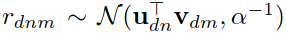

**对齐**user vector和item vector：

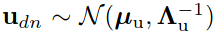                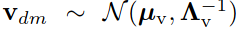  

> **Gaussian-Wishart先验分布**
>
> 用来估计多元正态样本的协方差矩阵而引入的**矩阵型**随机分布
>
> 作为正态分布的协方差矩阵的逆的共轭先验分布
>
> > 多元高斯分布均值分布的共轭是高斯分布，精度（方差的逆）分布的共轭为Gamma分布
>
> 
>
> 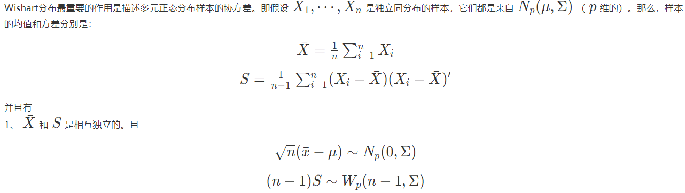

**训练过程：**

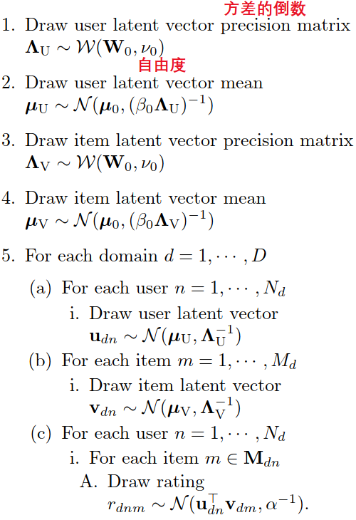

**推断过程：**

包括user/item vector、高斯参数通过**Gibbs 采样**，根据当前**其他参数的状态的条件概率**得到。

1. 从Gaussian-Wishart后验分布中采样user/item vectors的均值$\mu$、协方差$\Lambda$
2. 从以$\mu\quad \Lambda$的高斯分布中采样user/item vector
3. 估计打分值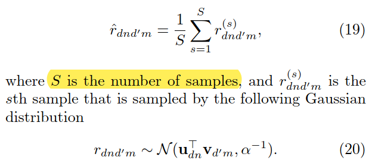

**改进：**本文所提出的方法假设所有的domain共享一个latent vector的分布。然而，一些latent vector仅用于某一domain，领域之间的关系有所不同。通过**引入domain-specific latent vector和shared latent vector**，**可建模domain heterogeneity**。

### Cross-domain Recommendation via Deep Domain Adaptation

> **基于内容的跨领域推荐**，解决冷启动，**可以不用user、item的overlap**
>
> **Domain Separation Network**, with a denoising autoencoder for item representation.

**目的：** 将source domain的item推荐给target domain,其中source domain和target domain无user overlap

**任务：** 通过video文本描述推荐新闻

**方法：** 使用domain separation network

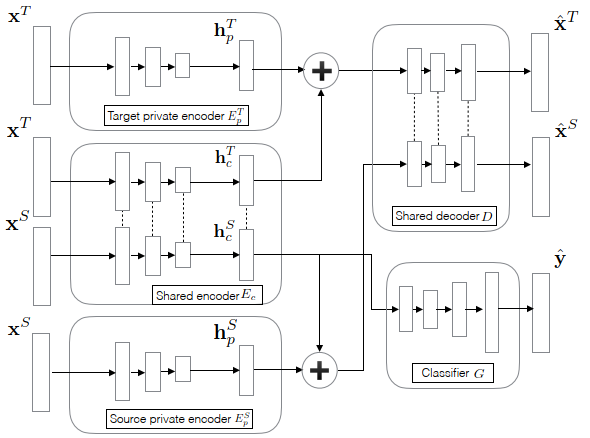

**损失函数：**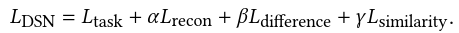

**DSN 损失：** 分类误差＋stack降噪自编码器重构误差＋共享/私有正交约束＋共享encoder的对抗损失(Gradient Reversal Layer)

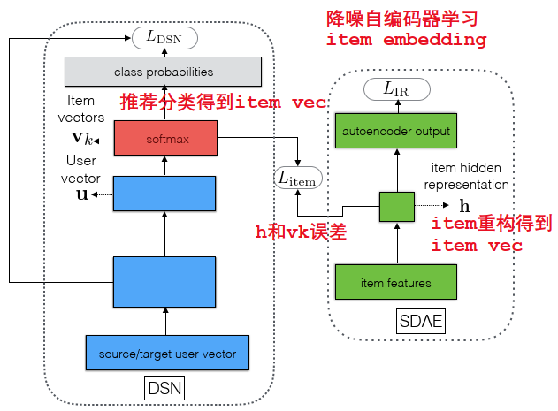

损失函数：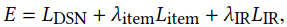

DSN损失＋item embedding差别＋降噪自编码器重构误差

### Connecting Social Media to E-Commerce: Cold-Start Product Recommendation Using Microblogging Information

> 需要user的overlap
>
> **目的**： 解决冷启动

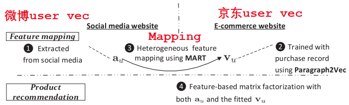

**流程：**

1. 微博feature（Demographic，Text，Network，Temporal）
2. 京东word2vec学习item vector，para2vec学习user vector
3. 在**linked user**中使用MART（Multiple Additive Regression Tree）作为回归问题学习两个user vector的映射

**Trick：**

1. 由于**linked user**数据量限制，将所有user vector平均$v^{sup}$，然后约束拟合到的user vector不能和平均vector差太多
2. 约束特征向量维度之间的相关性

**目标函数为：**

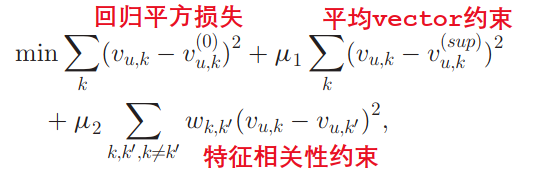

### Cross-Domain Recommendation: An Embedding and Mapping Approach

> MLP非线性映射（非线性好，但需要数据多）
>
> **选择性映射**（不是所有user/item适合映射，不active/popular的对映射有害）
>
> 需要overlap

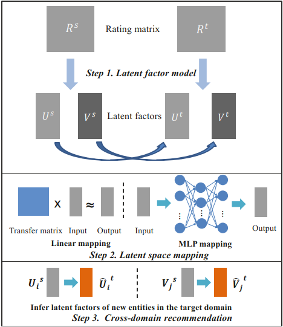

两种隐向量模型：**

1. MF：

   隐向量正态分布：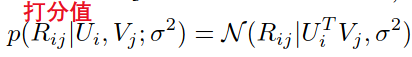

   目标函数：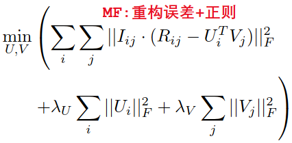

2. RBF（pair-wise的preference ranking模型）：

   相对偏好：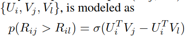

   目标函数：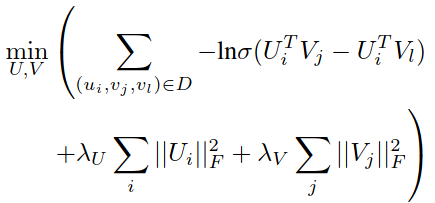

**两种映射模型：**

1. 线性
2. MLP非线性

**采样：**

学习映射模型时，采用**top-p percent of popular** entities 作为training set

### Cross-Domain Recommendation for Cold-Start Users via Neighborhood Based Feature Mapping

> 使用了三种相似度方法计算用户相似性
>
> 基于相似user邻居的GBT学习Mapping
>
> 需要user overlap

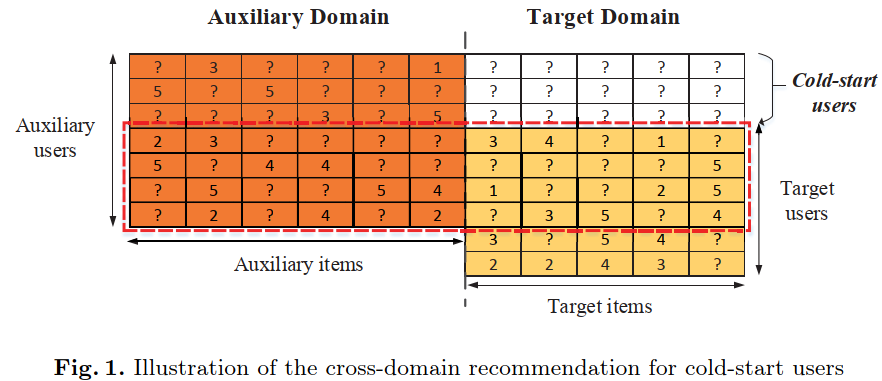

**基于用户相似度的矩阵分解：**

**动机：**

1. 不同user在不同domain 打分行为不同，分别在不同domain分解获得domain-specific latent feature
2. domain少了，稀疏了，所以加上用户相似度更好的进行分解

**三种相似度：**

1. Similarity Based on Common Ratings
2. Similarity Based on the Estimations of Having No Interest（用户不给打分代表不喜欢，概率事件，考虑item的popularity and reputation、user的打分行为）
3. Similarity Based on Rating Biases

**目标函数：**

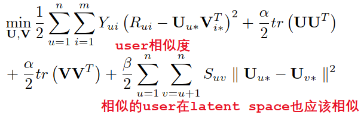

**基于邻居的latent mapping：**

由于分domain进行分解，需要在不同domain的latent space进行mapping

使用linked user基于GBT学习mapping

根据与cold-start user相似的用户在target domain的vectors获取cold-start user的vector

### Cross-Domain Recommendation via Clustering on Multi-Layer Graphs

> 多site，adults使用超过3个的社交网络
>
> **group knowledge**，通过社区检测(cross-source user community detection approach)获得，考虑inter-source relationships 。可以减少推荐的搜索空间，提供更好的候选
>
> **individual knowledge**，个人历史记录，个人偏好

**用户社区检测：**

最小割方法-NP hard问题

使用谱聚类，GNN，Grassman Manifolds衡量距离，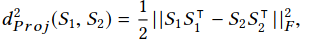

**考虑层间关系（相似度）：**

- 动机：
  - 数据模态不同，描述用户方式不同
  - 有些数据源或者模态更有信息（Foursquare和Twitter在不同方面有优势）
- 通过inter-layer similarity graph $R$ 和 the adjacency matrix $W_R$得到

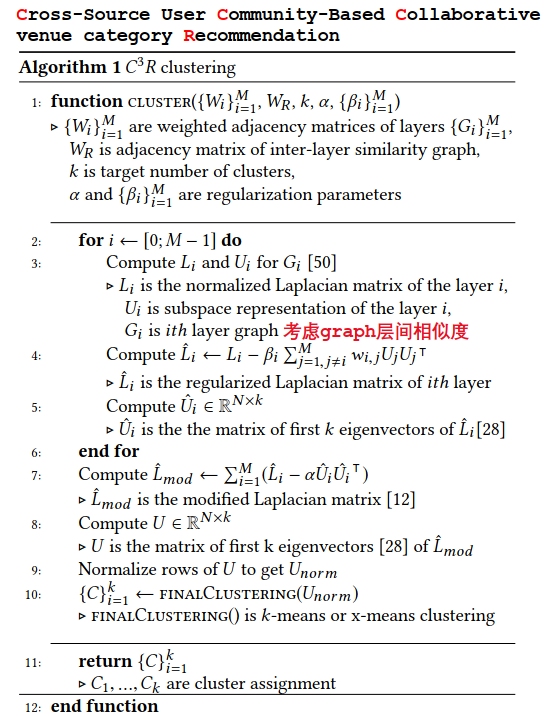

