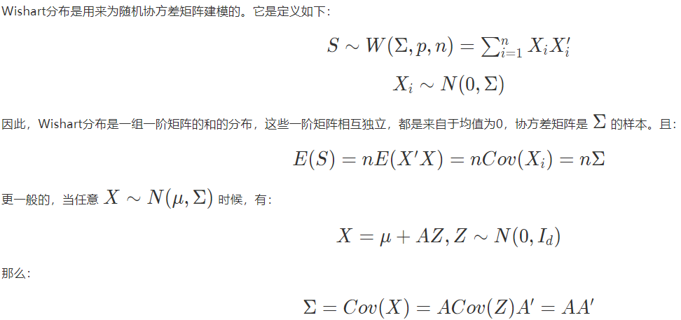

## Cross-Domain推荐系统

**跨领域推荐目的：**

- 解决冷启动
- 通过减少数据稀疏性，提高准确度
- 多样性、新奇性
- 强化用户模型（用户新偏好）

**冷启动以往解决方法：**

- 领域无关特征：性别、职业
- 辅助信息：search query、外部知识如Wikipedia

**跨领域推荐方法background**

- 协同过滤：
  - user、item不overlap，没有共同信息；
  - **解决：**
    - 假设domains共享同分布的高斯隐向量（贝叶斯概率矩阵分解）
    - 根据打分矩阵迁移cluster-level打分pattern
    - 只迁移打分矩阵的latent $\Lambda$（$V\Lambda U$）
- 基于内容：
  - social tag共享（Flickr）
  - DBpedia/Wikipedia来描述item
- 基于内容和协同过滤相结合
  - **Multi-view** *CCCFNet: A Content-Boosted Collaborative Filtering Neural Network for Cross Domain Recommender Systems*

> 以下方法基本上都是**迁移/对齐 latent knowledge**：
>
> - 直接矩阵分解，按照是否user/item overlap来迁移分解后的部分，或者Mapping后再迁移
> - 多元高斯分布拟合，迁移$\mu$和$\Lambda$
> - 共享私有disentanglement，然后迁移共享

### 1. Cross-domain recommendation without shared users or items by sharing latent vector distributions

> 基于**矩阵分解**
>
> 假设不同domain的**latent vector**服从**相同均值和协方差矩阵的高斯分布**

本文为**无监督目标匹配方法**，不同领域间没有alignment information下找到目标之间关系

latent vector学习**两阶段：**

- 每个领域的latent vector
- latent vector对齐

**user vector** $u_{dn}$，**item vector** $v_{dm}$，**打分**

**对齐**user vector和item vector：

                  

> **Gaussian-Wishart先验分布**
>
> 用来估计多元正态样本的协方差矩阵而引入的**矩阵型**随机分布
>
> 作为正态分布的协方差矩阵的逆的共轭先验分布
>
> > 多元高斯分布均值分布的共轭是高斯分布，精度（方差的逆）分布的共轭为Gamma分布
>
> 
>
> 

**训练过程：**

**推断过程：**

包括user/item vector、高斯参数通过**Gibbs 采样**，根据当前**其他参数的状态的条件概率**得到。

1. 从Gaussian-Wishart后验分布中采样user/item vectors的均值$\mu$、协方差$\Lambda$
2. 从以$\mu\quad \Lambda$的高斯分布中采样user/item vector
3. 估计打分值

**改进：**本文所提出的方法假设所有的domain共享一个latent vector的分布。然而，一些latent vector仅用于某一domain，领域之间的关系有所不同。通过**引入domain-specific latent vector和shared latent vector**，**可建模domain heterogeneity**。

### 2. Cross-domain Recommendation via Deep Domain Adaptation

> **基于内容的跨领域推荐**，解决冷启动，**可以不用user、item的overlap**
>
> **Domain Separation Network**, with a denoising autoencoder for item representation.

**目的：** 将source domain的item推荐给target domain,其中source domain和target domain无user overlap

**任务：** 通过video文本描述推荐新闻

**方法：** 使用domain separation network

**损失函数：**

**DSN 损失：** 分类误差＋stack降噪自编码器重构误差＋共享/私有正交约束＋共享encoder的对抗损失(Gradient Reversal Layer)

损失函数：

DSN损失＋item embedding差别＋降噪自编码器重构误差