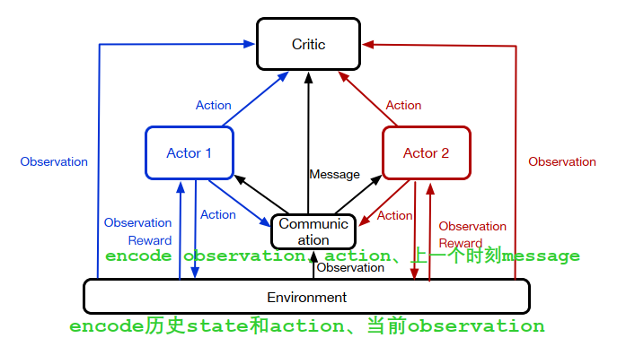
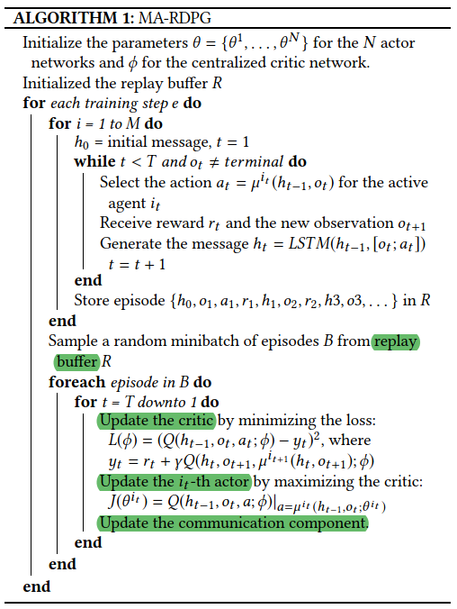

## Model-Based Reinforcement Learning with Adversarial Training for Online Recommendation

> 现有方法关注于Model-free的方法，其需要不断与环境交互，成本大。
> Off-Policy方法使用重要性采样可缓解此问题，但需要大量log数据，不适用于大的action space。
>
> - 需要和user交互，探索unexplored action和state space
> - 代价高-探索过程伤害user满意度，丢失用户
>
> 不同的feedback反应用户的不同兴趣：
>
> - clicks-短期兴趣
> - purchase-长期兴趣（在若干click后发生）

> Model-free 方法不显式建模agent-user的交互。
>
> - value-based方法，如Deep Q-learning，不稳定，不易收敛
> - policy-based方法，如policy gradient，稳定，但由于学习和架构的限制没有实际交互带来data bias；重要性采样可解决data bias，但带来较大variance。

本文根据离线数据构建了用户行为模型，并使用其和agent交互来训练policy（REINFORCE算法）。

- 优点：有效采样、减少离线数据中的噪音
- 缺点：估计的用户行为模型和实际的环境容易有bias、policy经常更新(不一致的推荐)降低用户满意度
- 解决：引入对抗训练(判别器用来判断real or fake 的trajectories)来训练用户行为模型

## Learning to Collaborate: Multi-Scenario Ranking via Multi-Agent Reinforcement Learning
> 为多场景排序联合优化，电商平台中有竞争行为：
>
> - 广告系统提高CTR
> - 店铺搜索提高GMV
>
> 场景：
>
> - Main Search：在搜索框搜索，返回多个domain的various item，是用户的主要行为
> - In-Shop Search：店铺内搜索
> - 淘宝中，25.46%从main search切换到in-shop search，9.12%从in-shop search切换回main search
>
> 单独优化方法有以下缺点：
>
> - 场景之间缺少协作
> - 场景之间不能联合建模
>
> **Multi-Agent Recurrent Deterministic Policy Gradient (MA-RDPG)**
>
> - Agent：每个场景中的每个排序策略
> - 不同Agent共享全局Critic Net，协同达到全局目标
> - Agent之间发送信息：RNN来encode历史action和observation

关键组件：

- 共享Critic（本文场景中，用户在时刻t只能在一个场景中，因此**同一时刻只有一个actor会用到critic**）
- 私有的actor；**确定性策略**，，**接收partially observable state，即local observation**（包括customer属性（年龄、性别、购买力）item属性（价格，转换率，购买量）query类型（main还是in-shop））
- 通信组件；
- 全局environment；，即淘宝平台，**当actor发出动作时改变状态，并向actor提供reward**
- **Reward：**
  - 当有购买行为时，reward=购买的item价格；
  - 当有点击行为，reward=1；
  - 无购买或无点击，reward=-1；
  - 没有购买并退出，reward=-5

