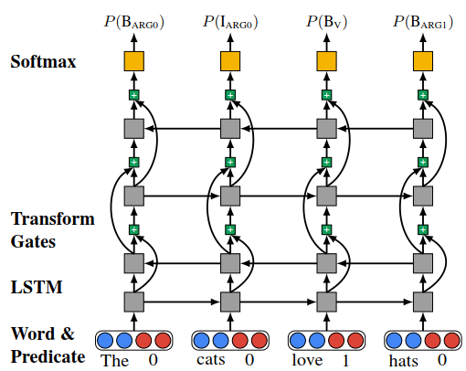

## Dependency Parser

### 《Simple and Accurate Dependency Parsing Using Bidirectional LSTM Feature Representations》

applying it to a greedy transition-based parser as well as to a globally optimized graph-based parser

> Modern approaches to dependency parsing can be broadly **categorized into graph-based and transition-based parsers** (Kübler et al., 2009).
>
> Graph-based parsers (McDonald, 2006) treat parsing as a search-based structured prediction problem in which the goal is learning a scoring function over dependency trees such that the correct tree is scored above all other trees. Transition-based parsers (Nivre, 2004; Nivre, 2008) treat parsing as a sequence of actions that produce a parse tree, and a classifier is trained to score the possible actions at each stage of the process and guide the parsing process.

## Joint

### 《Greedy, Joint Syntactic-Semantic Parsing with Stack LSTMs》

> **Stack LSTMs** (Dyer et al., 2015) are LSTMs that allow for stack operations: query, push, and pop. A “stack pointer” is maintained which determines which cell in the LSTM provides the memory and hidden units when computing the new memory cell contents. 

## Semantic

### 《Deep Semantic Role Labeling: What Works and What’s Next》

#### Abstract

> We use a deep highway BiLSTM architecture with constrained decoding
>
>   (1) deep models excel at recovering long-distance dependencies but can still make surprisingly obvious errors, and (2) that there is still room for syntactic parsers to improve these results.

#### Introduction

> Recently break-throughs involving end-to-end deep models for SRL without syntactic input (Zhou and Xu, 2015; Marcheggiani et al., 2017) seem to overturn the long-held belief that syntactic parsing is a prerequisite for this task
>
> Zhou and Xu (2015) treat SRL as a BIO tagging problem and use deep bidirectional LSTMs. 

#### Model

> scoring function with penalization terms:
>
> 
>
> 
>
> Highway LSTM with four layers. The curved connections represent highway connections, and the plus symbols represent transform gates that control inter-layer information flow.
>
> 
>
> To **alleviate the vanishing gradient problem** when training deep BiLSTMs, we use gated highway connections
>
> Constrained $A^*$ Decoding：
>
> SRL Constraints Punyakanok et al. (2008)described a list of **SRL specific global constraints**:
>
> 1. Unique core roles (U): Each core role (ARG0-ARG5, ARGA) should appear at most once for each predicate.
> 2. Continuation roles (C): A continuation role C-X can exist only when its base role X is realized before it.
> 3. Reference roles (R): A reference role R-X can exist only when its base role X is realized (not necessarily before R-X).
>
> $$A^*$$ search in this setting finds the optimal sequence for all sentences and is therefore **equivalent to Viterbi decoding.**

#### Analysis

> performance tends to **degrade**, for all models, for **arguments further from the predicate**.
>
> 
>
> the neural model performance deteriorates less severely on long-range dependencies than traditional syntax-based models
>
> high-quality syntax can still make a large impact on SRL.
>
> off-the-shelf neural methods have a remarkable ability to learn long-range dependencies, syntactic constituency structure, and global constraints without coding task-specific mechanisms for doing so

### 《The Necessity of Syntactic Parsing for Semantic Role Labeling》

#### Abstract

> Our conclusions demonstrate that **syntactic parse information is clearly most relevant in the very first stage – the pruning stage**. In addition, the quality of the pruning stage cannot be determined solely based on its recall and precision. Instead it depends on the characteristics of the output candidates that make downstream problems easier or harder.

### 《Exploiting Mutual Benefits between Syntax and Semantic Roles using Neural Network》

#### Abstract

> studying a parsing→SRL pipeline, a SRL→parsing pipeline, and a simple joint model by embedding sharing

#### Introduction

> As a shallow semantic task, semantic role labeling (SRL) models have traditionally been built upon syntactic parsing results
>
> Existing methods typically use semantic features to rerank n-best lists of syntactic parsing models
>
> First, we propose a novel **parsing→SRL pipeline using a tree Long Short Term Memory (LSTM)** model (Tai et al., 2015) **to represent parser outputs**, **before feeding them to the neural SRL model as inputs**. Second, we investigate a SRL→parsing pipeline, using semantic role label embeddings to enrich parser features. Third, we build a joint training model by embedding sharing, which is the most shallow level of parameter sharing between deep neural networks. 
>
> We show that the state-of-the-art LSTM semantic role labeler of Zhou and Xu (2015), which has been shown to be able to **induce syntactic features automatically**, can still be improved using parser output features via **tree LSTM** (Tai et al., 2015)
>
> We employ the Stack-LSTM model of Dyer et al. (2015) for dependency parsing.
>
> ***DEP→SRL Pipeline:***
>
> In this pipeline model, we apply Stack-LSTM parsing first and feed the results **as additional features** for SRL.
>
> We propose a novel way of defining $dep_{t^¯}$, by using hidden vector $h_{t^¯}$ of a dependency tree LSTM (Tai et al., 2015) at $w_{t^¯}$ as $dep_{t^¯}$.
>
> 
>
> ***SRL→DEP Pipeline:***
>
> 
>
>  ***Joint Model by Parameter Sharing:***
>
> 
>
> due to different neural structures, there is no sharing of other parameters. The joint model offers the simplest version of shared training (Collobert et al., 2011), but **does not employ shared decoding** (Sutton and McCallum, 2005; Zhang and Clark, 2008b). Syntax and semantic roles are assigned separately, avoiding error propagation.

#### Experiments

> stochastically set singletons as UNK token in each training iteration with a probability $p_{unk}$. (**OOV**)

