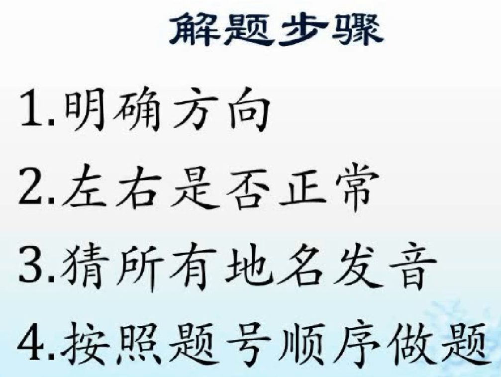
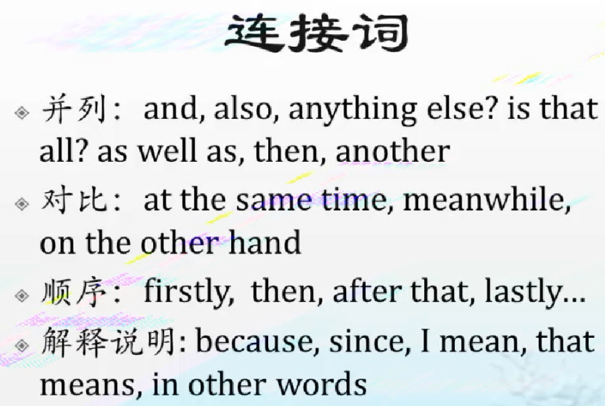
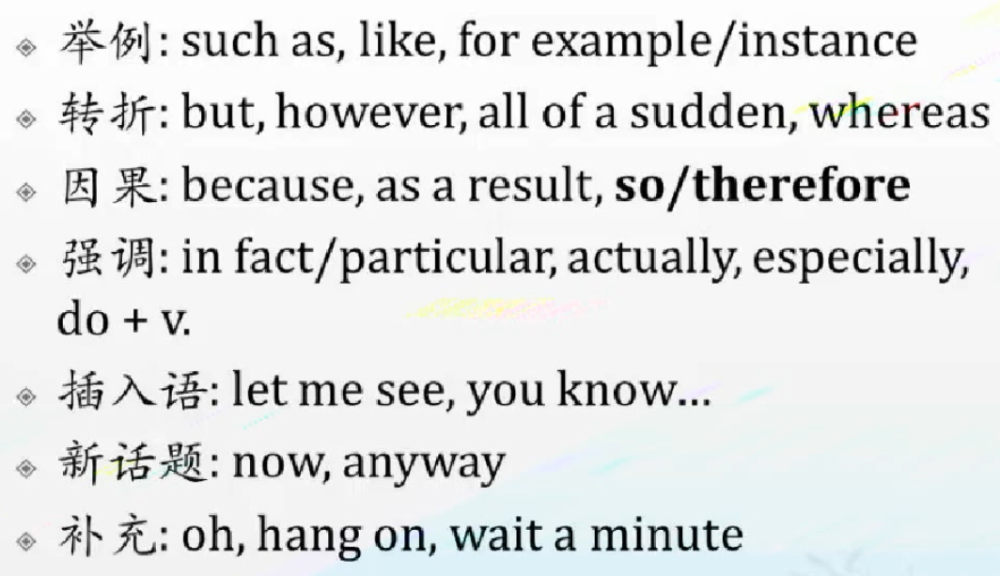
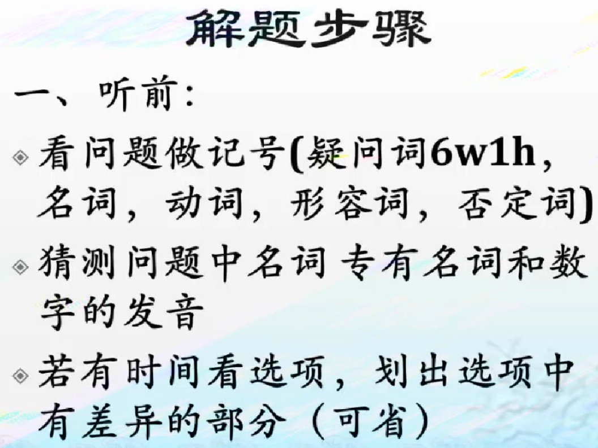
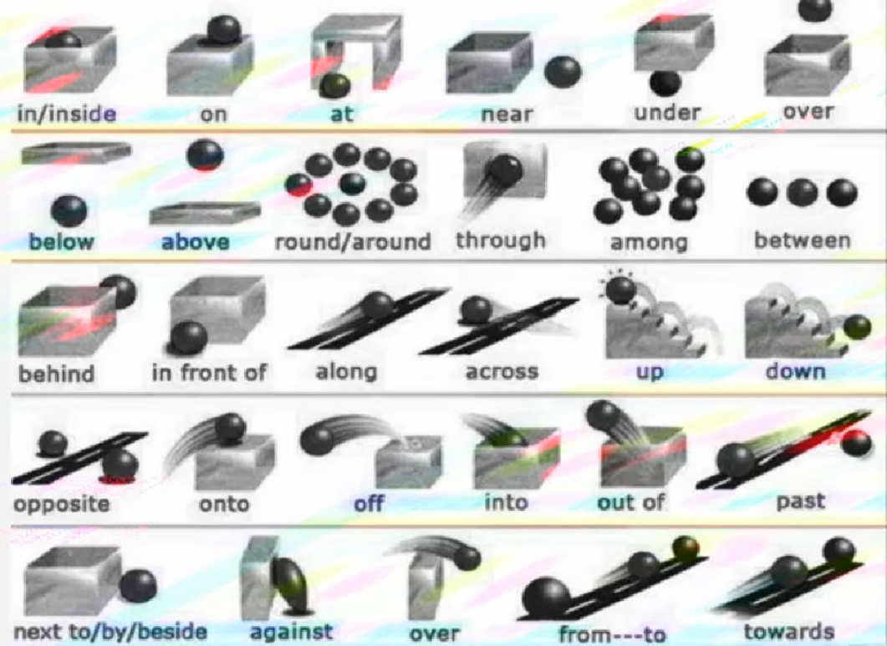
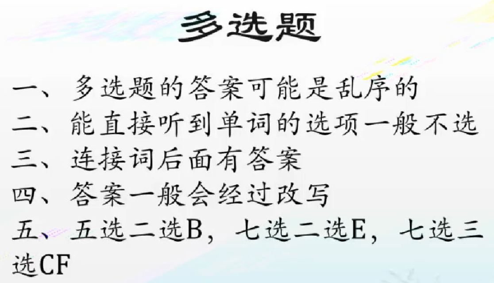

## 听力

何琼、王勇

### 先看要求字数限制

more than three words，12、twelve

### 发音

**连读**

an apple	an hour

just do it	->	just do wit	go on/up

**弱读**

and	=>	a	steak and vegetable	sit and be peaceful

**失音(辅音)**

black coffee	office staff	good day(前后相连，一样的读一个)

**吞音**

### 地图题

标明：top	bottom	left	right

**改写**

单词（同类词）、句子改写

**一般后面有答案**

## 阅读

刘洪波

## 写作

杜世明、顾家北

## 口语

杨帅、慎小嶷、Frank

