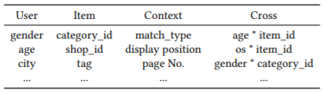
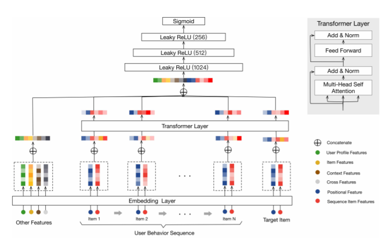
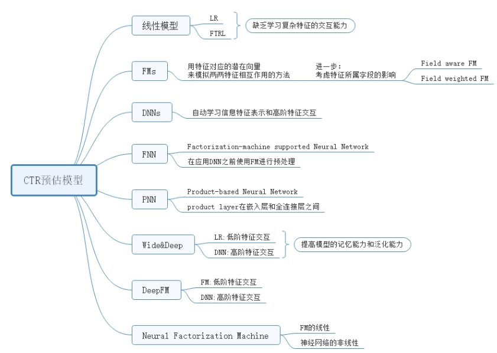
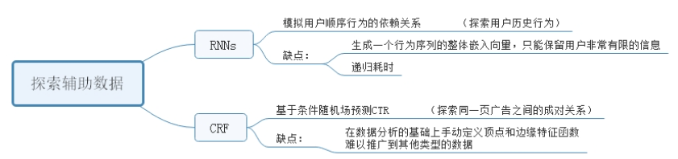
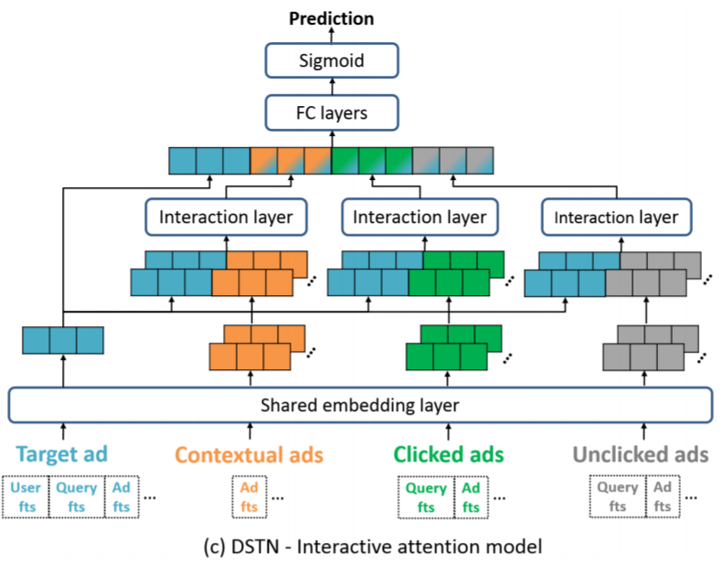

公司和客户三阶段关系AARRR：

1. 相识
2. 留存
3. 扩张

获取新用户的成本是维持已有用户成本的5倍

RFM (Recency, Frequency, Monetary Value) framework

关于用户价值分层，业界最权威的是**RFM模型**。R是指最近一次购买时间(用户活跃的时效性)，F是指购买次数(用户活跃次数)，M是指消费金额(用户消费金额贡献度)。其实也就是通过用户的三个特征，来对用户进行类别判断。

Buy Till You Die (BTYD) family(概率生成模型)

## An Engagement-Based Customer Lifetime Value System for E-commerce

技术困难：

- 用户级别行为的噪声属性， engagement程度
- 大量潜在的用户

模型：随机森林

特征集：Email，app， purchase behavior

客户类型：one-time，power user（使用不同特征权重，可解释性）

### 1. 特征集

Engagement（最重要特征）：

1. open Email

2. click Email

User experience：

1. 附近商品质量（对新用户和回流用户）
2. customer service（user review）

User behavior：

1. 不同时间尺度购买记录
2. preference是否随时间变化
3. 未兑换、赎回、折扣

其他：

1. 年龄、性别、城市、距离
2. 原始订阅和首次购买

### 2. 模型

用户划分：

​	经常购买的可以根据历史购买记录准确预测

根据购买频率分为六组：

1. Unactivated：没买过
2. New users：买过，但数据少不足以分组
3. One-time buyers：买一次
4. Sporadic buyers：大于一次
5. Power users：经常买

两阶段：

1. 判断是否购买
2. 购买价值

季节性和decay：

​	decay：自从上一个trigger event（购买行为）开始decay

## Customer Lifetime Value Prediction Using Embeddings

目的：

1. shopping频率
2. 订单大小
3. 用户留存率

问题：大量user 的CLTV是0

特征：

1. user信息
2. 购买记录
3. 收益信息
4. session log

订单数量、购买的item数量、session数最重要

users views学习user 的embedding

## A DEEP PROBABILISTIC MODEL FOR CUSTOMER LIFETIME VALUE PREDICTION
根据预测的LTV对用户分类，然后投放广告

guide customer relationship management (CRM)

挑战:

1. 长尾分布,大量用户是Unactivated or one-time,新用户的purchase frequency和recency都一样(2/8原则)
2. MSE不适合0值LTV和对大值LTV比较敏感
3. 对于回头客,LTV易变,LTV的分布highly倾斜

同时预测流失率和LTV(不用构建two-stage模型-二分类重复购买和回归模型后头客的LTV,或者购买频率和购买值两个回归)

验证时采用normalized基尼系数,衡量从high-value到low-value

特征:购买历史(最重要),用户信息,订单,回流历史,客户服务

## To Be or Not to Be… Social: Incorporating Simple Social Features in Mobile Game Customer Lifetime
Value Predictions
加入社交属性,构建社交图,closeness, betweeness, PageRank等

## optimove.com

### customer behavior model

客户行为建模被定义为创建数学结构以表示在特定客户组之间观察到的常见行为，以便预测相似客户在相似情况下的行为。

难点：

1. 经验丰富的[客户分析](https://www.optimove.com/learning-center/deep-customer-analytics/)专家既昂贵又很难找到，并且他们需要使用的数学技术复杂且风险很大。
2. 即使已经建立了客户行为模型，也很难为营销人员的目的来操纵它，即，确切地为每个客户或一组客户采取何种营销措施。
3. 尽管数学模型很复杂，但大多数客户模型实际上都相对简单。由于这种必要性，大多数客户行为模型忽略了许多相关因素，以至于他们生成的预测通常不是很可靠。

RFM问题：

1. RFM模型仅描述客户过去所做的事情，而不能准确预测未来的行为。
2. RFM模型在特定时间点查看客户，而不考虑客户过去的行为方式或当前找到客户的生命周期阶段；除非随时间推移分析客户的行为，否则准确的客户建模非常薄弱。

Optimove：

1. [将客户](https://www.optimove.com/learning-center/customer-segmentation/)分成小组并根据实际行为解决单个客户–而不是硬编码任何使客户彼此相似的先入为主的观念或假设，而不是仅查看隐藏了重要事实的汇总/平均数据个人客户
2. 跟踪客户及其随时间推移在不同细分之间的移动方式（即动态细分），包括客户生命周期背景和同类分析-而不是仅仅确定客户现在处于哪个细分中而无需考虑他们如何到达那里
3. 使用预测性客户行为建模技术准确地[预测](https://www.optimove.com/learning-center/predictive-behavior-modeling/)客户[的未来行为](https://www.optimove.com/learning-center/predictive-behavior-modeling/)（例如，转化，流失，花费更多，花费更少）–而不是仅仅查看历史数据的后视镜
4. 使用高级计算来确定每个客户的[客户生命周期价值](https://www.optimove.com/learning-center/customer-lifetime-value/)（LTV）并以此为依据-而不是只看客户可能给公司带来的短期收入
5. 基于客观指标，确切地[知道](https://www.optimove.com/learning-center/marketing-action-optimization/)每个客户[现在要做什么营销活动](https://www.optimove.com/learning-center/marketing-action-optimization/)，以最大化每个客户的长期价值，而不是试图根据仪表板或大量报告来弄清楚该做什么。
6. 使用[行销机器学习](https://www.optimove.com/learning-center/machine-learning/)技术，这些技术可以揭示洞察力并提出建议，以改善人类行销商不太可能自己发现的客户行销。

传统方法和Optimove方法之间差异是，前者就像是客户快照，而后者是客户动画。客户的动画视图更具启发性，可以更准确地预测客户行为。

- 哪些营销活动最有效地将每个免费用户转换为付费客户？
- 哪些客户将流失，哪些营销活动最有效地挽留每个客户？
- 哪些客户将来会减少支出，哪些营销措施最有效地使他们保持当前的支出水平？
- 哪些客户有潜力成为大客户，哪些营销活动将最有效地增加每个客户的支出？

different stages of the customer lifecycle：

1. **Anonymous site visitors**
2. **Registered users**
3. **First-time users**
4. **Sporadic users**
5. **Frequent users**
6. **Risk-of-churn users**
7. **Churned users**
8. **Reactivated users**
9. **Terminate**

RFM细分（每个维度将客户划分为四个层）：

| **新近度**       | **频率**               | **货币**             |
| ---------------- | ---------------------- | -------------------- |
| R-Tier-1（最新） | F-Tier-1（最常见）     | M-Tier-1（支出最高） |
| R-Tier-2         | F-Tier-2               | M-Tier-2             |
| R-Tier-3         | F-Tier-3               | M-Tier-3             |
| R-Tier-4（最新） | F-Tier-4（仅一笔交易） | M-Tier-4（支出最低） |

- **最佳客户** –该组由在R-Tier-1，F-Tier-1和M-Tier-1中找到的那些客户组成，这意味着他们最近进行交易的频率高，交易频繁且花费比其他客户更多。该段的缩写符号为1-1-1。
- **高消费新客户** –该组由1-4-1和1-4-2中的那些客户组成。这些客户只进行过一次交易，但是最近才交易，他们花了很多钱。
- **支出最低的活跃忠诚客户** –该组由细分市场1-1-3和1-1-4中的那些客户组成（他们最近才交易，并且交易频繁，但花费最少）。
- **流失的最佳客户** –此细分受众群包括**4-1-1、4-1-2、4-2-1**和4-2-2组中的那些客户（他们交易频繁且花费很多，但时间长了因为他们已经交易了）。

## Customer Sequence Behavior model 

### Behavior Sequence Transformer for E-commerce Recommendation in Alibaba

### Customer Shopping Pattern Prediction: A Recurrent Neural Network Approach

customer behavior prediction model

1. client loyalty number→user ID

2. RFM→做user segment

This model incorporates **social media location check-ins**, **historical preferences** of the customer, the **influence of the**
**customer’s social network**, and **customer’s mobility characteristics** as inputs to the model.

------

### Deep Session Interest Network for Click-Through Rate Prediction

考虑session，30min分割：方便对用户时序的兴趣变化进行建模。

1. **同一个session内的行为高度同构**

2. **不同sessions间的behavior异构**

session内部：Transformer，优化position embedding→Bias embedding

session之间：BiLSTM

session之间activation unit门机制改进

### Deep Spatio-Temporal Neural Networks for Click-Through Rate Prediction

上下文广告、用户点击过的广告、用户未点击的广告

DSTN - Interactive Attention Model：针对不同的目标广告，不同类型的辅助广告信息的权重会不断变化，同时权重也没有进行归一化，避免了归一化带来的种种问题。

