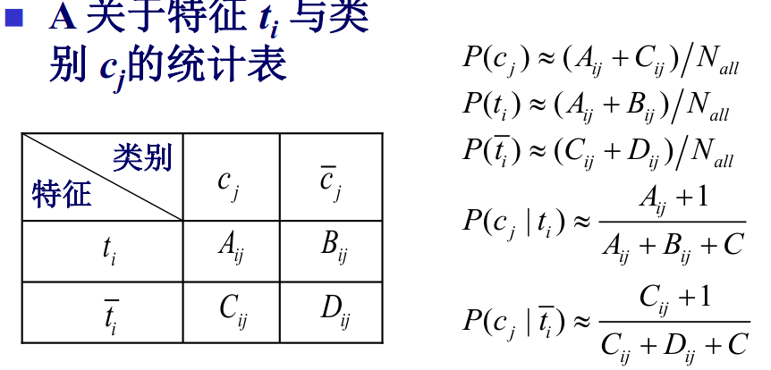
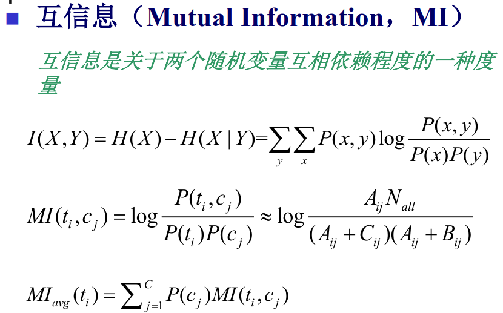
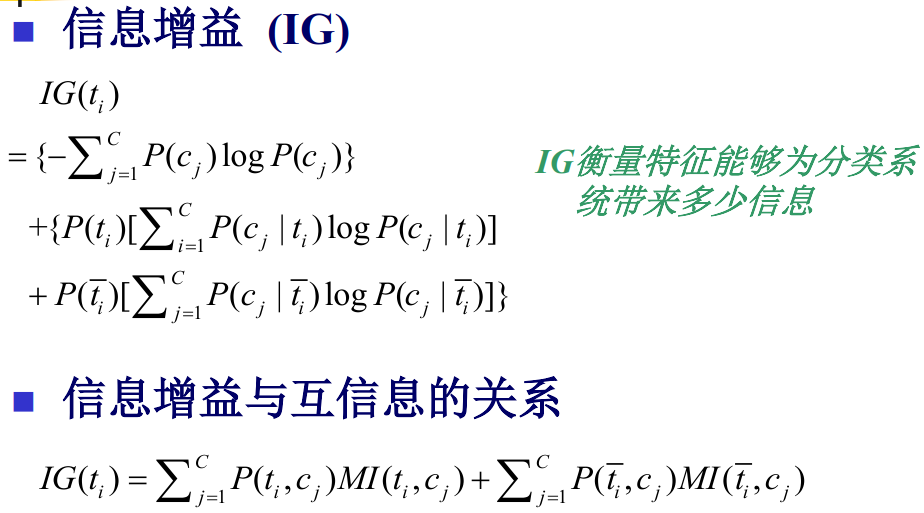
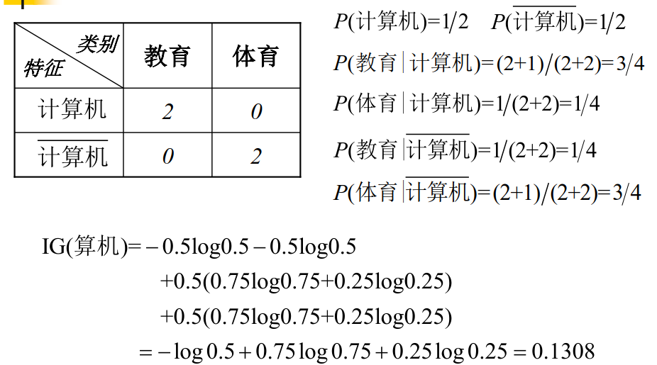
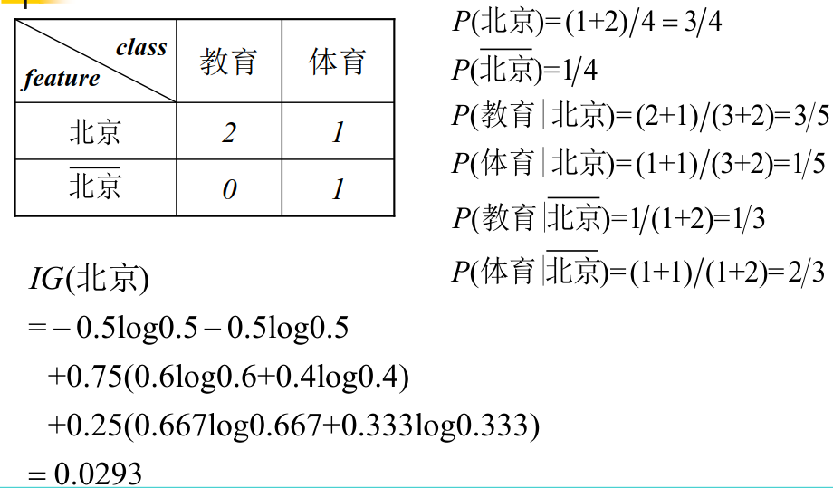
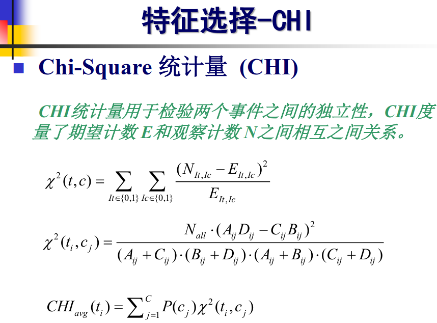
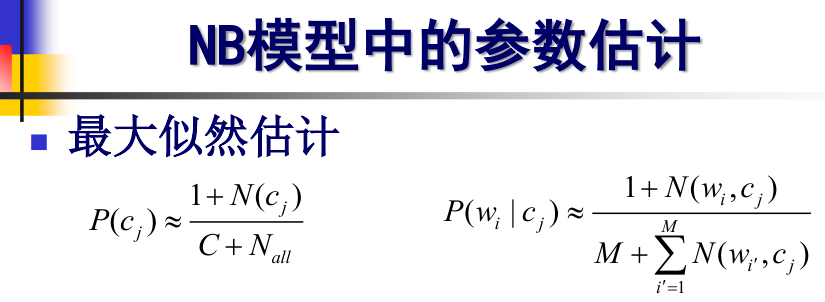
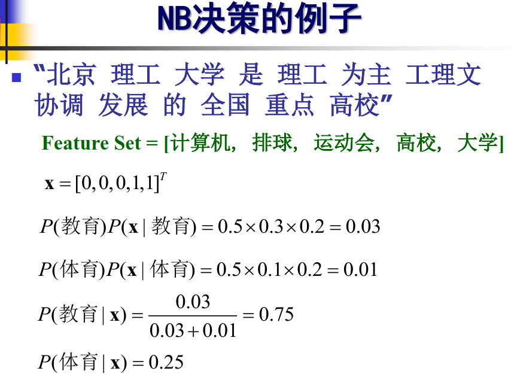

### 1. 文本分类

#### 文本表示

向量空间模型（Vector Space Model, VSM） 也称为词袋模型（Bag-of-Words Model, BOW） 

#### 特征选择 

1. 文档频率（Document Frequency, DF） 

2. 互信息（Mutual Information, MI） 

3. 信息增益（Information Gain, IG）

   

    

   

   

   

4. Chi-Square统计（Chi-Square Statistics，CHI） 

   

#### 分类算法

- 监督学习 

  - 生成式模型 
	- 朴素贝叶斯（Naïve Bayes） 
  - 判别式模型 
  	- 线性判别函数（Linear Discriminate Function） 
  	- 支持向量机（Support Vector Machine） 
  	- 最大熵模型（Maximum Entropy） 
- 无监督、半监督学习  

- 模型表示 

  用参数进行建模（构建目标函数） 

- 学习算法 

  最大似然、最大后验（生成式模型） 
  梯度下降、牛顿法（判别式模型） 

- 推断 

  决策/预测规则 

### 2. 文本聚类

**文本聚类算法** 

- 分割法 

  K-means算法 
  K-medoids算法 
  CLARANS算法 

- 层次法 

  BIRCH算法 
  CURE算法 

- 基于密度的方法 

- 基于网格的方法 

### 3. 情感分析

**观点挖掘与倾向性分析相关任务** 

- 观点及倾向性识别 

  情感识别（Sentiment Identification） 

- 观点要素抽取 

  观点属性抽取（Opinion Attribute Extraction） 
  观点摘要（Opinion Summarization） 

- 观点检索 