### 1. 形式语言

**语言描述的三种途径**

1. 穷举法
2. 语法描述
3. 自动机

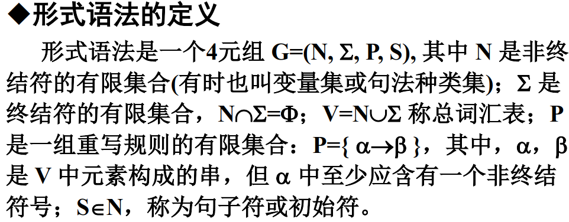

**最左推导、最右推导和规范推导**

1. 约定每步推导中只改写最左边的那个非终结符，这种推导称为“最左推导”。
2. 约定每步推导中只改写最右边的那个非终结符，这种推导称为“最右推导”。
3. 最右推导也称规范推导。

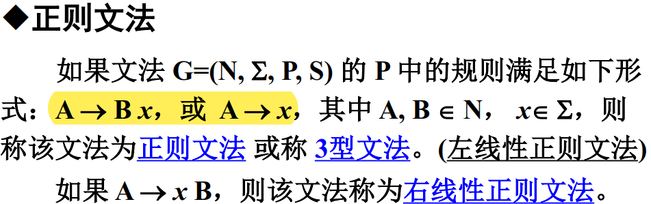

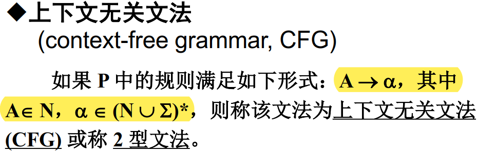

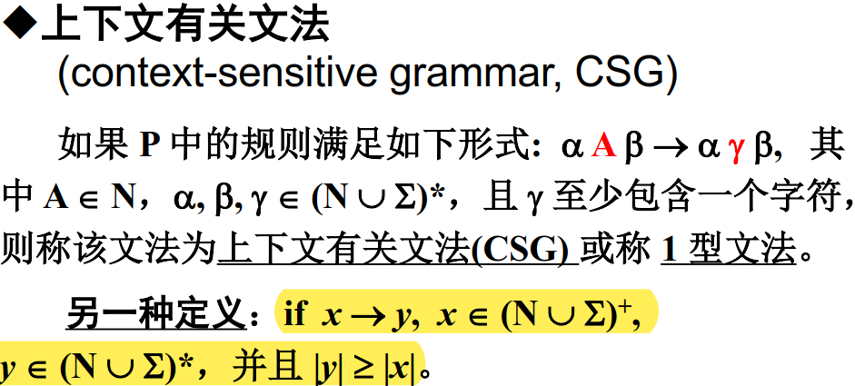

**上下文无关文法的二义性**
一个文法 G，如果存在某个句子有不只一棵分析树与之对应，那么称这个文法是二义的。

### 2. 有限自动机与正则文法

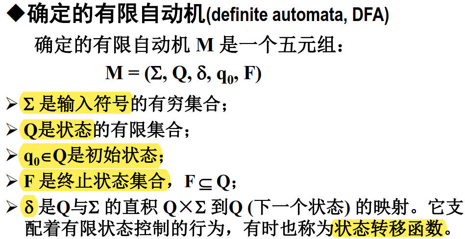

**NFA 与DFA 的区别**
NFA 与 DFA 的唯一区别是：在 NFA 中$\delta (q, a)$ 是一个状态集合，而在 DFA 中$\delta (q, a)$ 是一个状态。

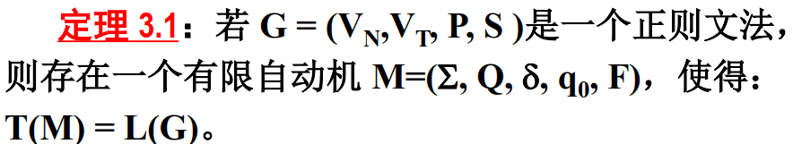

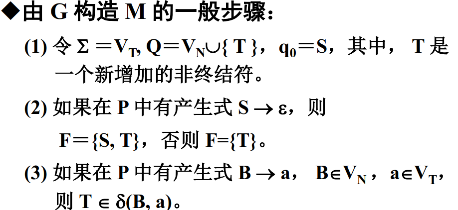

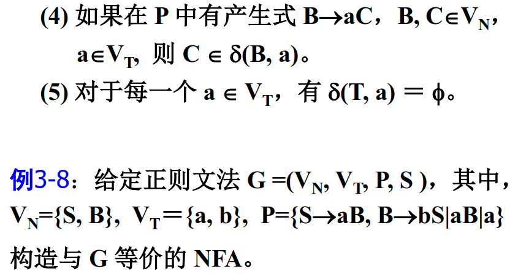

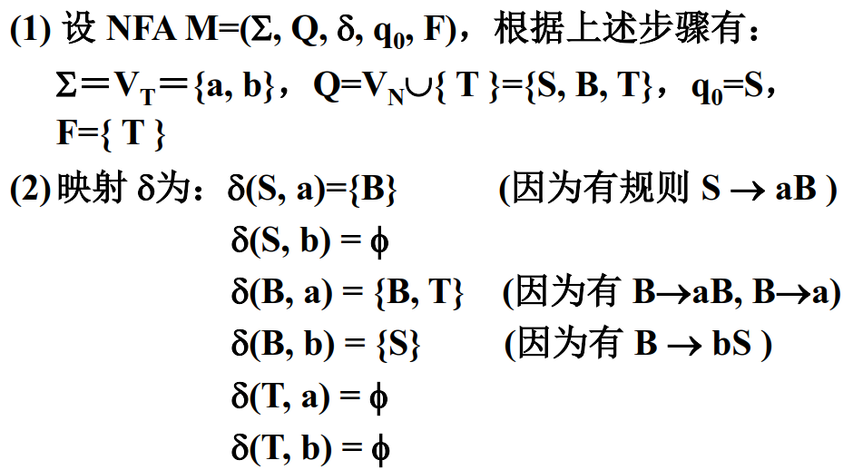

### 3. 下推自动机与CFG

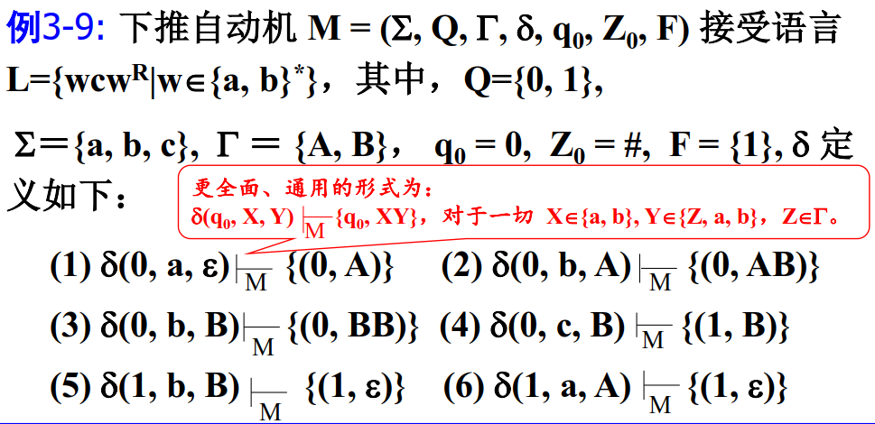

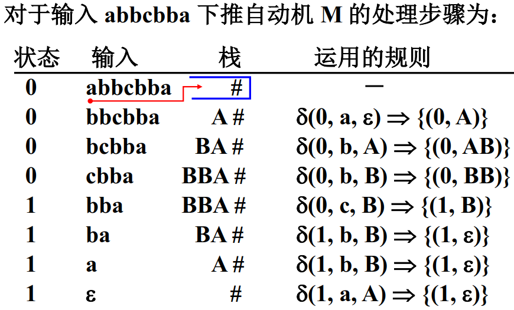

>各类自动机的主要区别是它们能够使用的信息存储空间的差异：有限状态自动机只能用状态来存储信息；下推自动机除了可以用状态以外，还可以用下推存储器(栈)；线性带限自动机可以利用状态和输入/输出带本身。因为输入/输出带没有“先进后出”的限制，因此，其功能大于栈；而图灵机的存储空间没有任何限制。

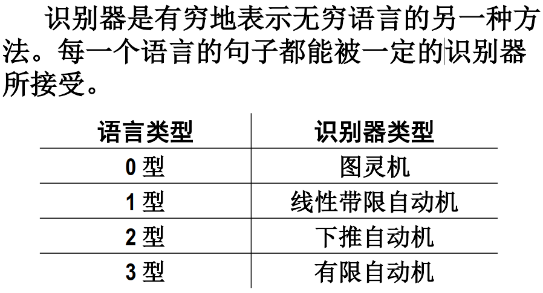

### 4. 有限自动机与状态转移机的应用

1. 英文单词拼写检查
2. 英文单词形态分析