## 一、Probabilistic Generative Models

### 1. LDA

> *参考：*
>
> 1. https://www.cnblogs.com/pinard/p/6831308.html

引入隐藏变量---主题：

$P(w_{j}|d_{i}) = \sum _{k} P(w_{j}|z_{k}) \cdot  P(z_{k}|d_{i})$

共轭分布：分布的分布，先验(Dir) + 数据似然(多项式)=后验(Dir)；一方面符合直觉，另一方面可作为先验链，在Gibbs采样中有用

模型结构：

生成过程：

其中$\beta=(\beta_1,\beta_2\dots \beta_k)$，k是topic数，$\beta_i$是topic-word的概率分布

参数求解：

- Gibbs采样：

  - Training：

    1.选择合适的主题数K, 选择合适的超参数向量$\alpha\ \eta $

    2.对应语料库中每一篇文档的每一个词，随机的赋予一个主题编号z

    3.重新扫描语料库，对于每一个词，利用Gibbs采样公式更新它的topic编号，并更新语料库中该词的编号

    4.重复第3步的基于坐标轴轮换的Gibbs采样，直到Gibbs采样收敛

    5.统计语料库中的各个文档各个词的主题，得到文档主题分布$\theta_d$，统计语料库中各个主题词的分布，得到LDA的主题与词的分布$\beta_k$

  - Inference：

    *利用topic-word分布$E_{Dir(\beta_k)}(\beta_{kt})$，需要得到该新文档的主题分布$E_{Dir(\theta_d)}(\theta_{dk})$*

    1.对应当前文档的每一个词，随机的赋予一个主题编号z

    2.重新扫描当前文档，对于每一个词，利用Gibbs采样公式更新它的topic编号

    3.重复第2步的基于坐标轴轮换的Gibbs采样，直到Gibbs采样收敛

    4.统计文档中各个词的主题，得到该文档主题分布

- Variational Inference

  模型参数是$\alpha \ \eta$，求解目标是$\theta\ \beta\ z$，由于$\theta\ \beta\ z$之间的耦合性，需要使用变分假设，假设所有的隐藏变量都是通过各自的独立分布形成的(mean field theory)，这样就去掉了隐藏变量之间的耦合关系。

  隐藏变量的概率分布为：$p(\theta,\beta, z | w, \alpha, \eta) = \frac{p(\theta,\beta, z,  w| \alpha, \eta)}{p(w|\alpha, \eta)}$

  引入平均场理论后，隐藏变量的分布相对独立：

  

  $\begin{align} q(\beta, z, \theta|\lambda,\phi, \gamma)   =  \prod_{k=1}^Kq(\beta_k|\lambda_k)\prod_{d=1}^M(q(\theta_d|\gamma_d)\prod_{n=1}^{N_d}q(z_{dn}| \phi_{dn})) \end{align}$

  最小化估计分布和真实分布：

  $(\lambda^*,\phi^*, \gamma^*) = \underbrace{arg \;min}_{\lambda,\phi, \gamma} KL(q(\beta, z, \theta|\lambda,\phi, \gamma) || p(\theta,\beta, z | w, \alpha, \eta))$

  $\begin{align} log(w|\alpha,\eta) & = log \int\int \sum\limits_z p(\theta,\beta, z,  w| \alpha, \eta) d\theta d\beta \\ & = log \int\int \sum\limits_z \frac{p(\theta,\beta, z,  w| \alpha, \eta) q(\beta, z, \theta|\lambda,\phi, \gamma)}{q(\beta, z, \theta|\lambda,\phi, \gamma)}d\theta d\beta  \\ & = log\;E_q \frac{p(\theta,\beta, z,  w| \alpha, \eta) }{q(\beta, z, \theta|\lambda,\phi, \gamma)} \\ & \geq E_q\; log\frac{p(\theta,\beta, z,  w| \alpha, \eta) }{q(\beta, z, \theta|\lambda,\phi, \gamma)} \\ & = E_q\; log{p(\theta,\beta, z,  w| \alpha, \eta) } - E_q\; log{q(\beta, z, \theta|\lambda,\phi, \gamma)} \end{align}$

  $\begin{align} log(w|\alpha,\eta) =  L(\lambda,\phi, \gamma; \alpha, \eta)  + KL(q(\beta, z, \theta|\lambda,\phi, \gamma) || p(\theta,\beta, z | w, \alpha, \eta))   \end{align}$

  其中$L(\lambda,\phi, \gamma; \alpha, \eta) = E_q\; log{p(\theta,\beta, z,  w| \alpha, \eta) } - E_q\; log{q(\beta, z, \theta|\lambda,\phi, \gamma)}$成为变分下界ELBO(Evidence Lower Bound)

  由于对数似然部分为常量，因此最小化KL散度等价于最大化ELBO

  $\begin{align} L(\lambda,\phi, \gamma; \alpha, \eta) & = E_q[logp(\beta|\eta)] +  E_q[logp(z|\theta)]  + E_q[logp(\theta|\alpha)] \\ & +  E_q[logp(w|z, \beta)] - E_q[logq(\beta|\lambda)] \\ & - E_q[logq(z|\phi)]   - E_q[logq(\theta|\gamma)]  \end{align}$

  指数分布族$p(x|\theta) = h(x) exp(\eta(\theta)*T(x) -A(\theta))$的性质:

  > 如果($x_1,x_2\dots x_n \sim Dir(\alpha)$)
  >
  > $E(x_i)=\frac{\alpha_i}{\sum\alpha_i}$
  >
  > $E(\log_{x_i})= \Psi(\lambda_{\alpha_i}) - \Psi(\sum\limits_{i^{'}=1}^V\lambda_{\alpha_i^{'}})$
  >
  > 其中$\Psi(x) = \frac{d}{d x}log\Gamma(x) = \frac{\Gamma^{'}(x)}{\Gamma(x)}$

  意味着在ELBO里面的期望表达式可以转化为求导来完成，这个技巧大大简化了计算量。
  
  然后利用EM算法求解模型参数

### 2. VAE

> *参考：*
>
> 1. https://kexue.fm/archives/5253
> 2. https://tiffer.cn/variational-autoencoder.html

$\log P(X) = ELBO + KL(Q||P)$

目标函数为y优化变分下界：

$ELBO= \log P(X) - D_{KL}[Q(z \vert X) \Vert P(z \vert X)] = E_{z \sim Q} [\log P(X \vert z)] - D_{KL}[Q(z \vert X) \Vert P(z)] $

最大化$E_{z \sim Q} [\log P(X \vert z)]$可以通过极大似然得到

对于$D_{KL}[Q(z \vert X) \Vert P(z)]$，假设$P(z) = N(0,1)$，

$\begin{aligned}&KL\Big(N(\mu,\sigma^2)\Big\Vert N(0,1)\Big)\\  =&\int \frac{1}{\sqrt{2\pi\sigma^2}}e^{-(x-\mu)^2/2\sigma^2} \left(\log \frac{e^{-(x-\mu)^2/2\sigma^2}/\sqrt{2\pi\sigma^2}}{e^{-x^2/2}/\sqrt{2\pi}}\right)dx\\  =&\int \frac{1}{\sqrt{2\pi\sigma^2}}e^{-(x-\mu)^2/2\sigma^2} \log \left\{\frac{1}{\sqrt{\sigma^2}}\exp\left\{\frac{1}{2}\big[x^2-(x-\mu)^2/\sigma^2\big]\right\} \right\}dx\\  =&\frac{1}{2}\int \frac{1}{\sqrt{2\pi\sigma^2}}e^{-(x-\mu)^2/2\sigma^2} \Big[-\log \sigma^2+x^2-(x-\mu)^2/\sigma^2 \Big] dx\end{aligned}$

整个结果分为三项积分，第一项实际上就是$-\log \sigma^2$乘以概率密度的积分（也就是1），所以结果是$-\log \sigma^2$；第二项实际是正态分布的二阶矩，正态分布的二阶矩为$\mu^2+\sigma^2$；而根据定义，第三项实际上就是“-方差除以方差=-1”。所以总结果就是$KL\Big(N(\mu,\sigma^2)\Big\Vert N(0,1)\Big)=\frac{1}{2}\Big(-\log \sigma^2+\mu^2+\sigma^2-1\Big)$，相当于对$\mu \ \sigma$加$L_2$正则

**Reparameterization Trick:**

采样操作是不可导的，而采样的结果是可导的

从$\mathcal{N}(\mu,\sigma^2)$中采样一个$Z$，相当于从$\mathcal{N}(0,I)$中采样一个$\varepsilon$，然后让$Z=\mu + \varepsilon \times \sigma$。

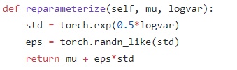

## 二、Neural Variational Inference

### 1. NVDM (Neural Variational Document Model)

[Neural Variational Inference for Text Processing](https://arxiv.org/pdf/1511.06038.pdf)

传统方法的约束：随着generation模型复杂度、深度的提升，高维积分给对后验分布的变分推断带来了困难；模型的微小改变就需要重新求导，限制了对数据的不同分布假设；数据规模较大时Gibbs采样效率低

于是，不同于传统的变分推断、近似采样等方法，NVI通过Black-Box直接对h后验概率进行建模，取得强大的生成能力。

Inference网络可以使用传统方法中较少使用的MLP、CNN、RNN等

通过Reparameterization trick (RT)，Inference网络可以通过反向传播来学习

#### Neural Variational Inference Framework

对于隐变量的后验分布$q(h)$，我们希望尽量接近真实的分布$p(h|x,y)$

对于$q_i(h|x,y)$，应用平均场理论，使其为对角高斯分布

构建Inference 网络的三步:

- 对观测数据进行向量化表达$u=f_x(x),v=f_y(y)$
- 学习隐变量$\pi=g(u,v)$
- 隐变量分布参数$\mu=l_1(\pi),\log\sigma=l_2(\pi)$

得到隐变量$h$后，变分下界对模型参数$\theta$求导为：

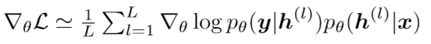

对于Inference网络参数$\phi$，经过RT后$h=\mu+\sigma$，

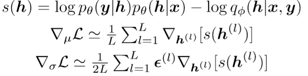

#### Neural Variational Document Model

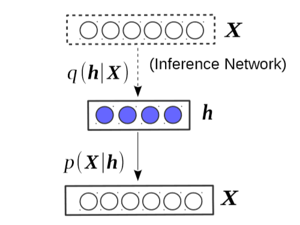

Inference网络：MLP：$X->h, p(h|X)$，推断隐藏话题分布

Generation网络：softmax decoder: $p(X|h)=\prod_i p(x_i|h)$

变分下界：

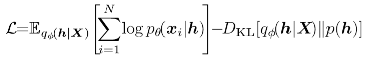

### 2. AVITM

[AutoEncoding Varitional Inference For Topic Models](https://arxiv.org/pdf/1703.01488.pdf)

使用 autoencoding variational Bayes (AEVB)解决传统LDA的缺点

->   Autoencoded Variational Inference For Topic Model(AVITM)，和标准的mean field 推断达到相似效果

两个挑战：

- Dirichlet分布限制了RT

  Dirichlet可以使用Laplace approximation 将其近似为 logistic normal 分布，于是Dirichlet可以近似为K(Topic 数，值较大)个独立的高斯分布，然后就可以通过RT采样出Dirichlet分布

  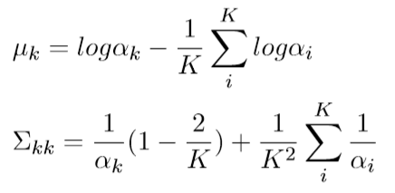

  于是将$p(\theta|\alpha)$近似为$\hat{p}(\mu_1|\sum_1)=\mathcal{NL}(\theta|\mu_1,\sum_1)$

- component collapsing：当latent 维度增加时，KL距离占主导，使隐变量后验分布逼近先验，陷入局部最优，topic都是相同的

  1. ADAM优化器，使用高动量权重和学习率
  2. 梯度裁剪

### 3. GraphBTM

[GraphBTM: Graph Enhanced Autoencoded Variational Inference for Biterm Topic Model](https://www.aclweb.org/anthology/D18-1495)

传统LDA的约束：在短文本上由于数据稀疏性(词共现稀疏)而表现不好

#### BTM

于是提出了BTM(Biterm Topic Model)，通过建模word-paris来学习topic，其缺点是没有体现Biterm之间的transitivity ；对整个语料学习一个topic分布而不是LDA中的每个文档

**生成过程：**

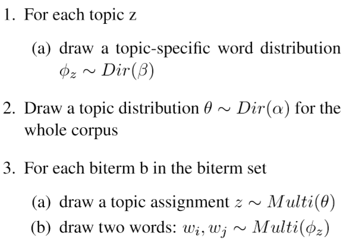

对于$b=(w_i,w_j)$

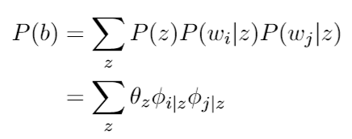

由于BTM和LDA一样对topic和word的先验分布的参数使用Dirichlet分布，但对于Dirichlet很难使用RT对ELBO得到一个可导的 Monte Carlo estimator，Dirichlet可以使用Laplace approximation 将其近似为 logistic normal 分布

#### GraphBTM

- 使用带有残差链接的GCN( Graph Convolutional Networks)来提取Biterm之间的transitivity，对于Biterm (A,B)和(A,C)，使用图来建模其间的transitivity，图的node为词，edge的weight为Biterms的共现次数；

  其中第L+1层的输出为$h^{l+1}=f(\tilde{D}^{-0.5}\tilde{A}\tilde{D}^{-0.5}(h^lW^l+b))$，其中$h^0$为输入特征，也即X，$\tilde{A}=A+I$是带有自连接的邻接矩阵，$\tilde{D}是\tilde{A}的度矩阵$。GCN也可以看作对Biterm不断进行Laplacian smoothing

- GraphBTM采样n个文档作为mini-corpus，并使用固定长度的窗口抽取Biterms，其平衡了LDA和BTM，

语料的似然为：

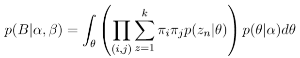

类似LDA，对于$\alpha \ \theta$分别引入两个变分参数$\gamma\ \phi$，优化目标为最大化变分下界$L(\gamma,\phi)=R-D_{KL}$

使用Inference网络计算变分参数，$(\mu_b,\sum_b)=f(b)$，于是可以通过logistic normal 将其近似为Dirichlet分布，$q_{\gamma}(\theta)=\mathcal{LN}(\theta|\mu_b,diag(\sum_b)$

### 4. NVCTM

[Neural Variational Correlated Topic Modeling](https://arxiv.org/pdf/1703.01488.pdf)

传统NVTM的约束是将topic建模为协方差矩阵为对角阵的高斯分布，其相互独立，与实际情况不符

#### Flow-based Methods for VAEs

优化推断网络中隐变量分布的学习 

- Householder flow

  打破隐变量的独立性假设，使用迭代的可逆的线性变换将一个各向同性高斯分布映射为非各向同性

  通过正交阵可以将isotropic Gaussian 映射为full covariance，Householder flow 使用k个Householder transformation的乘积表示正交阵。

  

  其中$h^0$是初始的isotropic Gaussian样本，$\pi$是MLP即Inference网络的输出，经过迭代得到non-isotropic Gaussian 的样本

  

  约束：Householder flow只能转换单个隐变量topic vector，计算重构误差是不够的

- Centralized Transformation Flow

  利用高斯分布的线性性，可以通过线性变换得到non-isotropic Gaussian样本：

  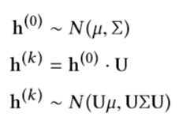

  其中$U=\prod_iH_i$，其中$H$的输入是MLP的输出和isotropic Gaussian的均值

  在CTF中，通过定义转换矩阵，可以将多个isotropic Gaussian 样本转换为non-isotropic的样本。

  模型如下：

  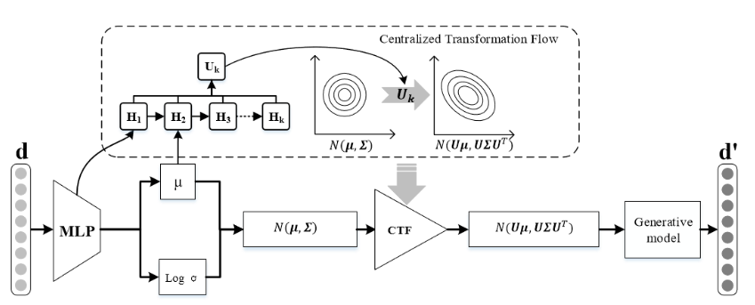

  NVCTM (Neural Variational Correlated Topic Model) 的目标函数是：

  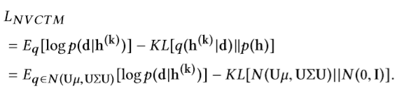

  其中重构误差通过隐变量topic分布中随机采样计算出

  对于KL距离，利用高斯分布的线性性：$h_0 \sim N(\mu, \sum) , \hat{h}=U \cdot h, \hat{h} \sim N(U\mu,U\sum U^T)$

  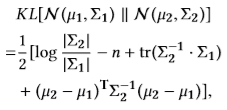

  于是得到 Transformation Flow Lower Bound(TFLB)：

  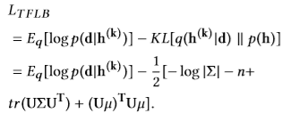

  作者使用point-wise mutual information来衡量topic之间的相关程度，证明比LDA、NVDM、GSM等模型更好的学习topic之间关系

  ### 总结

  NVI使用神经网络灵活的建模能力直接对隐变量的后验分布进行推断，通过Inference网络得到Varitional Parameters，不用像传统方法对变分参数进行严格数学推导，模型的微小改变就需要重新推导，不利于对数据的不同分布假设，并且可以避免因为数据规模增加带来Gibbs采样效率的下降。NVI使用Black-box的Inference网络带来了更加灵活的建模方式，如MLP、CNN、RNN等。
  
  总之，定义好Inference网络结构、隐变量的先验分布、ELBO目标函数即可进行隐变量学习，提供了更加一般性的方法。