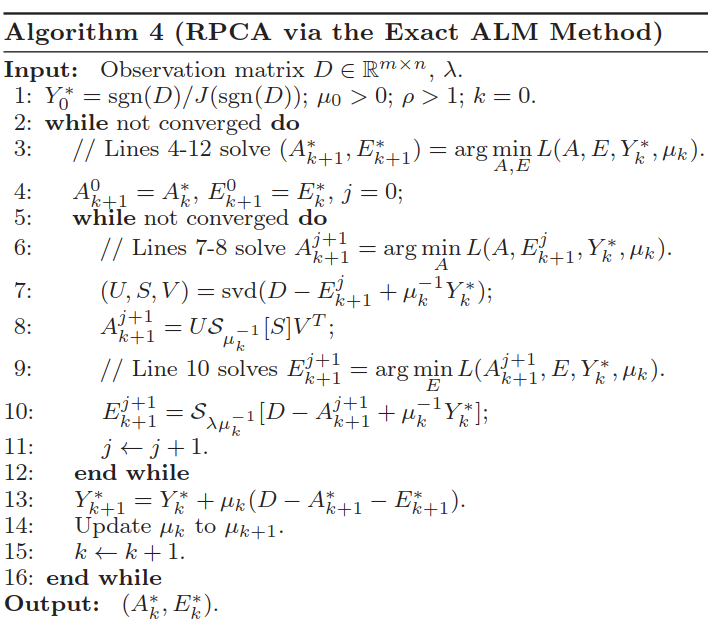
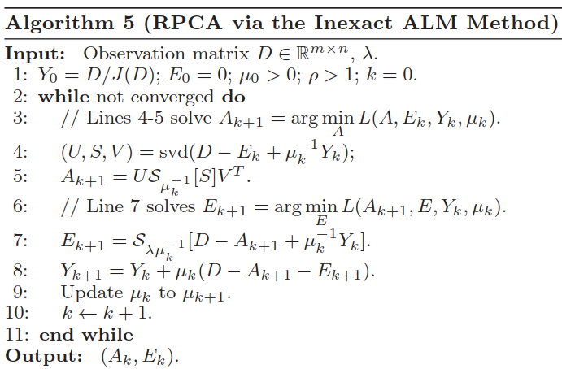
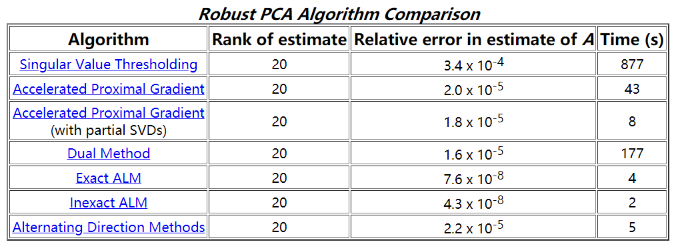
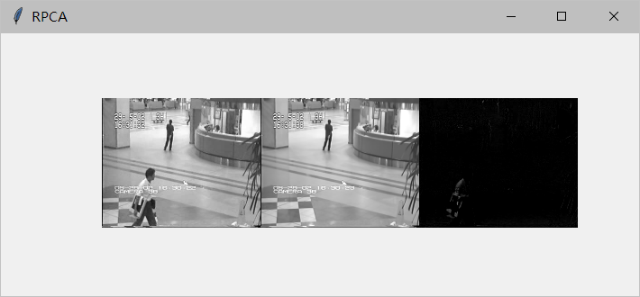

## Robust PCA进行背景建模

### 1. 原理

#### 1.1 Robust PCA

Principal Component Analysis (PCA) 是一种降维的常用手段，可以去除噪声和冗余，使用另一组基去重新描述得到的新的数据空间 ，并且尽可能得使约减后的维度尽可能接近原数据，也即最小化重构误差E=M-L。但是由于PCA前提假设数据的噪声是高斯的，对于大的噪声或者严重的离群点，PCA会被它影响，导致其无法正常工作。 

Robust PCA也是一种降维的方法。Robust PCA能够从corruption较大且稀疏噪声污染的观测数据中提取出低秩的数据。Robust PCA考虑的是这样一个问题：一般的数据矩阵D包含结构信息，也包含噪声。那么可以将这个矩阵分解为两个矩阵相加:D = A + E，A是低秩的（由于内部有一定的结构信息造成各行或列间是线性相关的，比如背景建模中的背景，基本保持不变，是线性相关的），E是稀疏的（含有噪声，则是稀疏的，比如背景建模中运动的物体），则Robust PCA可以写成以下的优化问题：$\min\limits_{A,E}\ rank(A)+\lambda ||E||_0\ s.t.\ A+E=D$，由于rank和$L_0$范数在优化上存在非凸和非光滑特性，所以一般将这个NP问题转换成求解一个松弛的凸优化问题： $\min\limits_{A,E}\ ||A||_*+\lambda ||E||_1\ s.t.\ A+E=D$。

#### 1.2 增广拉格朗日算法

在朴素拉格朗日形式上加上一个惩罚项 :

$$L(A,Z,Y)=||A||_*+\lambda||Z||_1+\frac{1}{2}\mu||D-A-E||^2_F+<Y,D-A-E>$$

$$其中||A||_*是nuclear\ norm，保证A是低秩的，||.||_F表示Frobenius范数$$

精确拉格朗日乘子法算法迭代过程如下：



非精确的增广拉格朗日乘子法，也即交替方向法：



几种优化算法对比：(http://perception.csl.illinois.edu/matrix-rank/sample_code.html)



### 2. 实验

代码:

```python
# -*- coding: utf-8 -*-
import os
import tkinter

import numpy as np
from PIL import Image, ImageTk
from scipy.linalg import svd

MAX_ITERS = 1000
TOL = 1.0e-7


def bitmap_to_mat(bitmap_seq):
    matrix = []
    for bitmap_file in bitmap_seq:
        im = Image.open(bitmap_file).convert('L')
        pixels = list(im.getdata())
        matrix.append(pixels)

    return np.array(matrix)


bmp_seq = map(
    lambda s: os.path.join("bmp_dir", s),
    os.listdir("bmp_dir")
)
res = bitmap_to_mat(bmp_seq)
np.save("bmp_out", res)


def show_img(matrices, w, h):
    mats = [np.load(x) for x in matrices]
    tk_win = tkinter.Toplevel()
    tk_win.title('RPCA')
    canvas = tkinter.Canvas(tk_win, width=4 * w, height=2 * h)
    canvas.pack()
    tk_ims = [None for _ in mats]
    for i, row in enumerate(mats[0]):
        ims = [Image.new('L', (w, h)) for _ in mats]
        for j, im in enumerate(ims):
            im.putdata(list(map(float, list(mats[j][i]))))
            tk_ims[j] = ImageTk.PhotoImage(im)
            canvas.create_image((j * w) + 200, h, image=tk_ims[j])
            canvas.update()


def converged(Z, d_norm):
    err = np.linalg.norm(Z, 'fro') / d_norm
    print('ERR', err)
    return err < TOL


def svd_(X, k=-1):
    U, S, V = svd(X, full_matrices=False)
    if k < 0:
        return U, S, V
    else:
        return U[:, :k], S[:k], V[:k, :]


def rpca(X):
    m, n = X.shape
    lamda = 1. / np.sqrt(m)
    Y = X
    u, s, v = svd_(Y, k=1)
    norm_two = s[0]
    norm_inf = np.linalg.norm(Y[:], np.inf) / lamda
    dual_norm = max(norm_two, norm_inf)
    Y = Y / dual_norm
    A_hat = np.zeros((m, n))
    E_hat = np.zeros((m, n))
    mu = 1.25 / norm_two
    mu_bar = mu * 1e7
    rho = 1.5
    d_norm = np.linalg.norm(X, 'fro')
    num_iters = 0
    total_svd = 0
    sv = 1
    while True:
        num_iters += 1
        temp_T = X - A_hat + (1 / mu) * Y
        E_hat = np.maximum(temp_T - lamda / mu, 0)
        E_hat = E_hat + np.minimum(temp_T + lamda / mu, 0)
        u, s, v = svd_(X - E_hat + (1 / mu) * Y, sv)
        diagS = np.diag(s)
        svp = len(np.where(s > 1 / mu))
        if svp < sv:
            sv = min(svp + 1, n)
        else:
            sv = min(svp + round(0.05 * n), n)
        A_hat = np.dot(
            np.dot(
                u[:, 0:svp],
                np.diag(s[0:svp] - 1 / mu)
            ),
            v[0:svp, :]
        )
        total_svd = total_svd + 1
        Z = X - A_hat - E_hat
        Y = Y + mu * Z
        mu = min(mu * rho, mu_bar)
        if converged(Z, d_norm) or num_iters >= MAX_ITERS:
            return A_hat, E_hat


data = np.load("bmp_out.npy")
A_hat, E_hat = rpca(data)
np.save("out_low_rank", A_hat)
np.save("out_sparse", E_hat)
show_img(["bmp_out.npy", "out_low_rank.npy", "out_sparse.npy"], 176, 144)
```

其中RPCA.py为代码文件，bmp_out.npy是原图像，out_low_rank.npy是背景，out_sparse.npy是前景。

如下图：




### 3. 参考文献：

[1] Lin Z, Chen M, Ma Y. The Augmented Lagrange Multiplier Method for Exact Recovery of Corrupted Low-Rank Matrices[J]. Eprint Arxiv, 2009, 9. 

[2] 周密, 宋占杰. 基于稀疏与低秩矩阵分解的视频背景建模[J]. 计算机应用研究, 2015, 32(10):3175-3178. 

[3] https://blog.csdn.net/u010510350/article/details/77803572

[4] https://jeremykarnowski.wordpress.com/2015/08/31/robust-principal-component-analysis-via-admm-in-python/

[5] http://blog.shriphani.com/2013/12/18/robust-principal-component-pursuit-background-matrix-recovery/

[6] http://perception.csl.illinois.edu/matrix-rank/introduction.html 