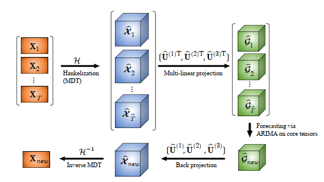

### Modeling Extreme Events in Time Series Prediction

Extreme Value Loss (EVL)解决长尾分布

记忆网络记忆历史中的极端事件，如自然灾害和经济危机。

### RobustSTL: A Robust Seasonal-Trend Decomposition Algorithmfor Long Time Series

回归+最小绝对误差 解决trend分解

STL不灵活，季节性特征shift，不适合长季节周期

常见的降噪方法是Low-pass filter、移动平均、高斯滤波

STL不灵活，季节性特征shift，不适合长季节周期

- 噪声项：使用bilateral filtering降噪

- 趋势项：假设趋势项主导时间序列，重构误差+平滑约束

- 周期项：不固定周期，考虑2H+1窗口内

### STFNets: Learning Sensing Signals from the Time-Frequency Perspective with Short-Time Fourier Neural Networks

谱操作可分为三类

1. filtering：全局模式匹配
2. convolution：局部特征
3. pooling：降维

### TiSSA: A Time Slice Self-Attention Approach for Modeling Sequential User Behaviors

GRU中加了时间间隔项

Feature Fusion：

### N-BEATS: NEURAL BASIS EXPANSION ANALYSIS FOR INTERPRETABLE TIME SERIES FORECASTING

DL和统计模型混合效果好

2H-7H去预测H长度

可解释性：

1. Trend：多项式拟合

2. Seasonal：傅里叶级数拟合

### DATA-GRU: Dual-Attention Time-Aware Gated Recurrent Unit for Irregular Multivariate Time Series

varying time intervals→Time-Aware
Gated Recurrent Unit (DATA-GRU)

missing
values→dual-attention

unreliability-aware attention mechanism to adjust weights
assigned to different data to ensure high-quality data play
important roles to promote prediction performance while the
influence of low-quality data is limited.

### Time Interval Aware Self-Attention for Sequential Recommendation

they model the time-order
but not the actual timestamp

only concerned about the relative
length of time intervals **in one user sequence**.

**Clipping the**
**maximum intervals** also avoids sparse relation encodings and enables the model to generalize to time intervals not seen during training.

### Multi-horizon time series forecasting with temporal attention learning

BiLSTM

decoder的未来不同时期作为不同模态，不同importance，然后combination

### Time-Series Anomaly Detection Service at Microso

Spectral Residual (SR) +CNN

The Spectral Residual (SR) algorithm consists of three major steps:

1. (1) Fourier Transform to get the log amplitude spectrum; 
2. (2) calculation of spectral residual; 
3. (3) Inverse Fourier Transform that transforms the sequence back to spatial domain.

### Personalized Purchase Prediction of Market Baskets with Wasserstein-Based Sequence Matching

KNN-SDTW选最相似的用户历史

Wasserstein distance作为衡量

### Meta Learning with Relational Information for Short Sequences
learning **heterogeneous**
**point process** models from **short event sequence** data along with a **relational network**.

**hierarchical Bayesian mixture Hawkes process model**

capture the underlying **mixed-community patterns** of the relational network, which
simultaneously encourages **knowledge sharing among sequences** and facilitates
adaptive learning for each individual sequence

Many existing literature considers **medium-length or long sequences**. They first model a sequence as
a parametric point process, e.g., **Poisson process, Hawkes process or their neural variants**, and apply
maximum likelihood estimation to find the optimal parameters

 across the communities the **variation of the subjects is large**,
while within the communities the **variation is small**

in a social
network, each user often has multiple identities

Motivated by above facts, we model **each sequence as a hierarchical Bayesian mixture of**
**Hawkes processes**

the weights of each Hawkes process are determined jointly by the hidden pattern
of sequences and the **relational information, e.g., social graphs.**

make **no assumption on the prior distribution** of the parameters of
Hawkes process

Hawkes processes：

self-exciting, i.e., the past
events always increase the chance of arrivals of new events.

Model-Agnostic Meta Learning：

exploit the **shared structure of the tasks**, to obtain models
that can perform well on each of the tasks. Specifically, MAML seeks to train a common model for
all tasks.

### Time-series Generative Adversarial Networks

autoregressive 分布+temporal 分布

global：

local（step-wise）：

S是静态特征

S generator，RNN generator

### GRU-ODE-Bayes: Continuous modeling of sporadically-observed time series

1. 连续时间GRU

2. Bayesian update network that processes the sporadic observations

### Latent ODEs for Irregularly-Sampled Time Series

> Recurrent neural networks (RNNs) are the dominant model class for high-dimensional, regularly-sampled time series data, such as text or speech. However, they are an awkward fit for irregularly-sampled time series data, common in medical or business settings. A standard trick for applying RNNs to irregular time series is to divide the timeline into equally-sized intervals, and impute or aggregate observations using averages. Such preprocessing destroys information, particularly about the timing of measurements, which can be informative about latent variables
>
> An approach which better matches reality is to construct a continuous-time model with a latent state defined at all times. Recently, steps have been taken in this direction, defining RNNs with continuous dynamics given by a simple exponential decay between observations
>
> we further **augment** Latent ODEs to jointly model times of observations **using a Poisson process**.

### DTWNet: a Dynamic Time Warping Network

Doppler
invariance

DTW not only outputs the distance value, but also reveals how two sequences are
aligned against each other.

Streaming Version of DTW

### Unsupervised Scalable Representation Learning for Multivariate Time Series

只用看相关工作

### Think Globally, Act Locally: A Deep Neural Network Approach to High-Dimensional Time Series
Forecasting

LeveledInit: Handling Diverse Scales with TCN

global TCN-MF（TCN+矩阵分解） model + local per time-series properties

### Fully Neural Network based Model for General Temporal Point Processes

神经网络泛化表示hazard function（integral of the intensity function）

### Tensorized LSTM with Adaptive Shared Memory for Learning Trends in Multivariate Time Series

多任务共享，学习trend

### Deep Unsupervised Binary Coding Networks for Multivariate Time Series Retrieval

判断时间序列相似：

1. DTW
2. 傅里叶变换
3. 小波分解
4. Piecewise Aggregate Approximation (PAA)
5. Locality Sensitive Hashing (LSH)
6. Sketch, Single, & Hash (SSH)
7. DeepBit and Hash-
   GAN, have been employed
   to learn binary representations

cluster使用KL距离

对抗是因为聚类可能会过拟合

### Time2Graph: Revisiting Time Series Modeling with Dynamic Shapelets
learn the representations of
a time series by extracting time-aware shapelets and constructing a shapelet evolution graph

DTW计算segment和shapelets的相似度，K个候选shapelets

### Relation Inference among Sensor Time Series in Smart Buildings with Metric Learning

Similarity Metric Learning for Time Series：

1. DTW
2. Deep Expected Alignment Distance (DECADE)
3. Warping Networks (WN)
4. Hidden Markov Model (HMM)
5. Markovian Event Model (MEMO)
6. Siamese network

短时傅里叶变换+Triple net判断相似性

### Block Hankel Tensor ARIMA for Multiple Short Time Series Forecasting

使用多路延迟MDT把time series矩阵转换为a high-order block Hankel tensor，which represents all the TS at each time point as
a tensor in a high-dimensional embedded space. 

高阶Hankel假设有 low-rank or
smooth manifold in the embedded space

然后使用low-rank Tucker decomposition分解出core tensor，在core tensor上使用ARIMA

最后inverse Tucker
decomposition and inverse MDT还原

### Joint Modeling of Local and Global Temporal Dynamics for Multivariate Time Series Forecasting with Missing Values

使用local（统计信息，Last Observation）+Global（local作为key去query，记忆网络）

### TapNet: Multivariate Time Series Classification with Attentional Prototypical Network

### Partial Correlation-based Attention  for Multivariate Time Series Forecasting 

