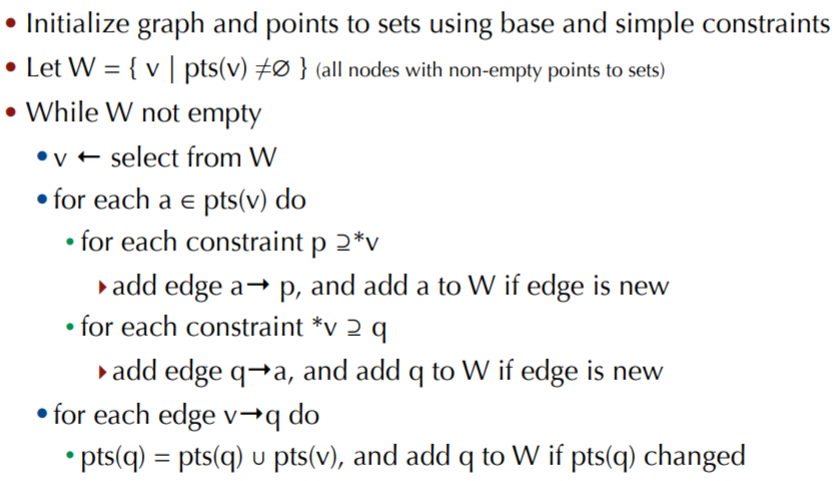

## 指针分析

> 指针分析是一类特殊的数据流问题，它是其它静态程序分析的基础，但指针使用的灵活性导致了指针分析的复杂性，**实际上指针分析是一个不可判定问题，所以实际的指针分析算法都是近似且保守的，须在效率和精度之间进行折衷**。
>
> 指针分析研究的内容主要集中在分析精度和时空开销之间的取舍，精度方面，主要指**流敏感性（flow-sensitivity）**和**上下文敏感性（context-sensitivity）**，一般而言，流敏感分析方法的精度明显好于流不敏感的分析方法，在上下文敏感性上也有同样的特点。
>
> 流不敏感的指针分析普遍使用在开源或者产品级高级编译器中，其中主要有两类：**基于包含（inclusion-based）的指针分析**和**基于合并（unification-based）的指针分析**。
>
> 基于包含的指针分析是一种基于约束集（constraint set）求解的**流不敏感**的指针分析方法，该指针分析又称为基于子集（subset-based）的指针分析或者基于约束的（constraint-based）的指针分析，在指针分析领域后来也被称之为Anderson风格的指针分析。其算法的时间复杂度为O(n3)。

在软件分析中，我们经常会遇到流敏感（flow-sensitive），路径敏感（path-sensitive）和上下文敏感（context-sensitive），这几个概念都主要出现在Data Flow Analysis中（或data flow的变型，如Taint Analysis等）。

简单来说，**流敏感（flow-sensitive）**指的是考虑程序语句执行的顺序，例如在数据流分析中的指针别名（Pointer Alias）分析中，一个非流敏感指针别名分析可能得出“变量x和y可能会指向同一位置”，而流敏感指针别名分析得出的结论类似于“在执行第20条指令后，变量x和y可能会指向同一位置” 。所以，一个非流敏感指针别名分析不考虑控制流，并认为所发现的别名在程序所有位置均成立。

**路径敏感（path-sensitive）**指的是依据条件分支语句的不同谓词，计算不同的分析信息，也就是说，路径敏感将跟踪程序控制流的每一个分支，以记录两个分支路径的不同程序状态。相应的，非路径敏感并不考虑分支之间的区别。简单的路径敏感存在“路径爆炸”（path explosion）或“无穷搜索空间”（infinite search space）的问题。

**上下文敏感（context-sensitive）**指的是在过程间分析（ Interprocedural Analysis）时，考虑函数调用的上下文信息。

### 指针分析的目的

对于任何一个指针／引用，能否在编译阶段就知道它会指向内存那块位置(位置在这里并不是0xFFFF这样的具体位置，而是说指向哪个stack/heap上local/object)呢？  通过把停机问题reduced to, 能证明指针问题是不可决定的。也就是不能对任何指针都准确的分析出它会确切指向哪。但这不妨碍我们求出近似解，从而在某些情况下能作出优化。  因此我们把问题转化为: **对于任何一个任何指针，能否在编译阶段知道它所有可能(may)指向的位置?**  最简单的回答自然是不知道(top),　这种回答没有实际意义，我们要的是更”紧”的答案。 

### Anderson算法

Anderson的指针分析算法是一种基于约束的方法，根据程序中语句建立变量与变量，或者变量与内存之间的约束关系。Anderson的方法分为两步，约束生成和约束求解。 

#### 1. 约束生成

约束类型分为三种，基本约束，简单约束，复杂约束，并有如下四种具体形式。 

| Constraint type | Assignment | Constraint |          Meaning           |
| :-------------: | :--------: | :--------: | :------------------------: |
|      Base       |   a = &b   |  a ⊇ {b}   |       loc(b)∈pts(a)        |
|     Simple      |   a = b    |   a ⊇ b    |      pts(a) ⊇ ptrs(b)      |
|     Complex     |   a = *b   |   a ⊇ *b   | ∀v∈pts(b). pts(a) ⊇ pts(v) |
|     Complex     |   *a = b   |   *a ⊇ b   | ∀v∈pts(a). pts(v) ⊇ pts(b) |

注：上图中的 loc(b) 表示 b 的地址， pts(a) 表示 a 可能指向的内存的集合 

#### 2. 约束图

约束图 G = <Var, E>，图中的节点为变量或者抽象的内存区域，每一个节点都关联一个对应的指向集。

约束图边的添加分为两种，

1. 在生成约束信息的时候，根据基本约束直接添加的边
2. 在约束求解的过程中，根据复杂约束进行“推导”添加的边

初始约束图的创建分为如下三步：

1. 首先为程序中的每个变量建立一个节点
2. 后根据基本约束标注节点的指向集
3. 每一个初始的简单约束建立一条有向边

#### 3.算法

